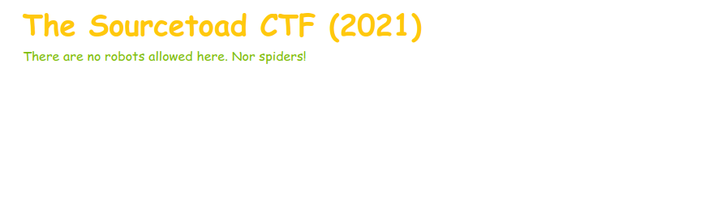

# Challenge 11 (Spidey) Solve

* Category - Web
* Difficulty - Medium



---

* This challenge was the first to really start exploring what a common website might have.
* The name of the challenge included Spidey and the description on the website said "No Robots"
  * I always find it funny with websites that there is normally a `robots.txt` file asking robots NOT to index
    * So those locations are usually pretty good to visit.
* So lets peek at the `robots.txt`

```
➜  curl https://challenges-a.[redacted].com/challenges/11-spidey/robots.txt
User-agent: *
Disallow /flag-to-come-34f34f% 
```

* Sure enough, we find a directory that is pretty obviously related to the flag.
* So lets head to it.

---


---
* You are left with the flag - `TOAD{51nc3-5P1d3r5-L1573n-70-7h323}`.