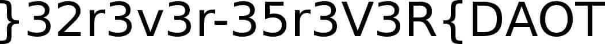

# Challenge 12 (Uno) Solve

* Category - File/Text
* Difficulty - Medium Hard


---

* This challenge looked like an evolution of the 7th challenge "hexy".
* However, some terms about Uno and "Wumbo" mode.
  * There is some reaching to do here, but lets list out the card types of Uno
    * Skip
    * Reverse
    * Draw Two
    * Wild
    * Draw Four / Wild
  * As well as listing about what "Wumbo" mode is: `The opposite of Mini`.
* So "Reverse" is the "Opposite" of just forward so perhaps opposite or reverse is in play.
* However, prior to all of that. Lets turn this back to binary.
---

```
➜  cat 12 | xxd -r -p - > 12.bin
➜  file 12.bin 
12.bin: data
```

* So we can see this time following the pattern of Puzzle 7, we no longer have an obvious file.
* I really like the tool [binwalk](http://manpages.org/binwalk) at this point.
  * It can scan files to find the common magic bytes of other files to list them.

```
➜  binwalk 12.bin 

DECIMAL       HEXADECIMAL     DESCRIPTION
--------------------------------------------------------------------------------
8662          0x21D6          JPEG image data, JFIF standard 1.01

```

* So this has detected a JPEG in the binary blob, but its at quite the end of the file.
* So lets extract it with binwalk.

```
➜  binwalk -e 12.bin -v       

Scan Time:     2021-10-03 20:20:33
Target File:   /home/ibotpeaches/Desktop/12.bin
MD5 Checksum:  b289eadf23cd73564274623c77b7f909
Signatures:    386

DECIMAL       HEXADECIMAL     DESCRIPTION
--------------------------------------------------------------------------------
8662          0x21D6          JPEG image data, JFIF standard 1.01
```

 * However, nothing happened here when we extracted it. So binwalk must have failed here.
 * So lets just look at a hex editor towards the location that binwalk found.


---

 * This is interesting. I see the magic bytes of a `JPEG`, but they are at the bottom of the file instead of top
 * The hint, which cost us 25 points says "Where there is a CAT, there is a TAC"
 * [cat](https://man7.org/linux/man-pages/man1/cat.1.html) is a tool and as well as [tac](https://man7.org/linux/man-pages/man1/tac.1.html)
   * So lets look at the description of `tac` - `concatenate and print files in reverse`
   * and also `cat` - `concatenate files and print on the standard output`
 * So lets do this again, but instead of `cat` the contents of `12` out. Lets use `tac`
---
 
```
➜  tac 12 | xxd -r -p - > 12.bin
➜  file 12.bin 
12.bin: JPEG image data, JFIF standard 1.01, aspect ratio, density 1x1, segment length 16, progressive, precision 8, 1052x78, frames 3
```

* Sure enough, now we have a real image.



* A bit of manual work left from us because its obviously reversed, but then we have the flag.

---
* You are left with the flag - `TOAD{R3V3r53-r3v3r23}`.