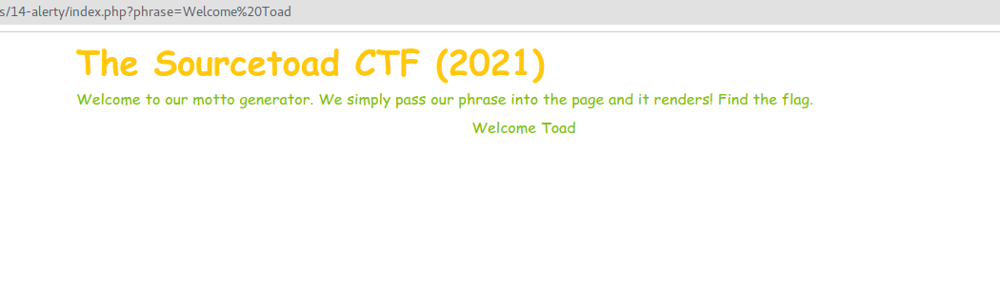
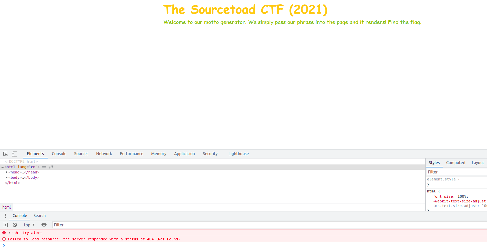
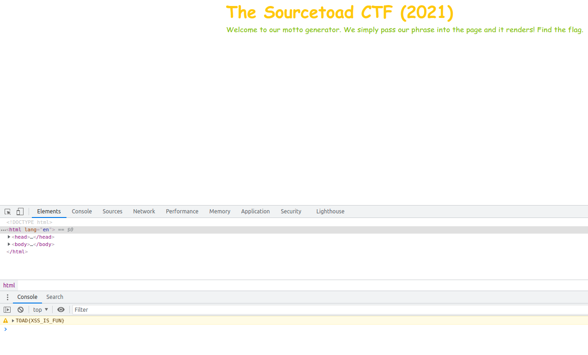

# Challenge 14 (Alerty) Solve

* Category - Web
* Difficulty - Medium Hard



---

* This challenge is back to the web with a title about "Alerty".
* Immediately viewing the page, we got redirected to `index.php?phrase=Welcome Toad`
  * As thought, changing `Welcome Toad` to anything results in that text printed on the page.
* This is fitting the realm of a chance of an XSS Attack
* Since no matter what type in is rendered onto the page, we could simply write JS and execute it.
* Though, what do we execute?
* If we peek the source, we do find a little obfuscated snippet of JS

```javascript
function _0x4382(_0x3802e0,_0x26c0eb){var _0x559ea9=_0x559e();return _0x4382=function(_0x438258,_0x441cbd){_0x438258=_0x438258-0x9d;var _0x2e3e6b=_0x559ea9[_0x438258];return _0x2e3e6b;},_0x4382(_0x3802e0,_0x26c0eb);}var _0x311101=_0x4382;(function(_0x39ddd4,_0x3c505b){var _0x4f4906=_0x4382,_0x52d89d=_0x39ddd4();while(!![]){try{var _0x230bc8=parseInt(_0x4f4906(0xa5))/0x1+parseInt(_0x4f4906(0x9e))/0x2*(-parseInt(_0x4f4906(0xab))/0x3)+parseInt(_0x4f4906(0x9f))/0x4*(-parseInt(_0x4f4906(0xa6))/0x5)+-parseInt(_0x4f4906(0xa4))/0x6*(parseInt(_0x4f4906(0xaa))/0x7)+parseInt(_0x4f4906(0xa7))/0x8*(-parseInt(_0x4f4906(0xad))/0x9)+parseInt(_0x4f4906(0x9d))/0xa+parseInt(_0x4f4906(0xa0))/0xb;if(_0x230bc8===_0x3c505b)break;else _0x52d89d['push'](_0x52d89d['shift']());}catch(_0x165843){_0x52d89d['push'](_0x52d89d['shift']());}}}(_0x559e,0xa3be5),window['console'][_0x311101(0xa8)]=function(){var _0x225e61=_0x311101;console[_0x225e61(0xac)](_0x225e61(0xa2)),window['console'][_0x225e61(0xa8)]=function(){return![];};},window[_0x311101(0xa9)]=function(){var _0x1df490=_0x311101;console[_0x1df490(0xa3)](atob(_0x1df490(0xa1)+'fRlVOfQ=='));});function _0x559e(){var _0x493f06=['2NvAZfL','516108RgaNCJ','43308177xQwuXf','VE9BRHtYU1NfSVN','nah, try alert','warn','1428VHNsLh','720883MddHYh','45WpzlCs','8WiGibk','log','alert','33789KQnihf','3784524TiIsQb','error','6274764BaDfxR','2814760GutjiT'];_0x559e=function(){return _0x493f06;};return _0x559e();}
```

* This looks quite packed so I doubt a Medium Hard challenge is reversing that string. So lets just start with a simple XSS

```
index.php?phrase=<script>console.log('test');</script>
```



* So this was odd. A message was printed to the console! So it worked.
* However, its not what I typed, instead printing `nah, try alert`
* So maybe we should try `alert('foo');` instead of `console.log('foo');`

```
index.php?phrase=<script>alert('test');</script>
```
* So running this test is a good XSS test bed. It should pop an alert up, which is obviously proof an XSS occurred.
* However, this did not happen. So it was time to look at the console again.



* Hidden in the console as a warning is `TOAD{XSS_IS_FUN}`

---
* You are left with the flag - `TOAD{XSS_IS_FUN}`.