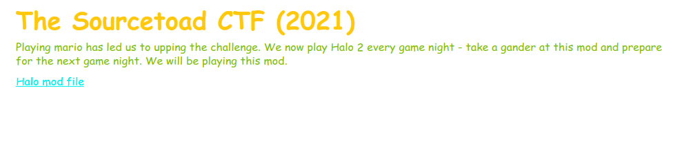

# Challenge 16 (HaloDepot) Solve

* Category - File/Text
* Difficulty - Medium Hard



---

 * So we are given a file that most probably have no idea about.
 * So like most tests. Lets just check what the file is:

```
➜  file challenge-16.serenity 
challenge-16.serenity: data
```

* So looks to be an unknown file of data.
* Based on Google searches, a Halo 2 map patch file.
* So lets run [strings](https://linux.die.net/man/1/strings) prior to any digging.

```
➜  strings challenge-16.serenity
R\U3
clean.map	
dirty.map
TOADER Adventures
TOAD{57R1n95-C0mM4ND-15-C00l}
```

 * So that was easy.

---
* You are left with the flag - `TOAD{57R1n95-C0mM4ND-15-C00l}`.