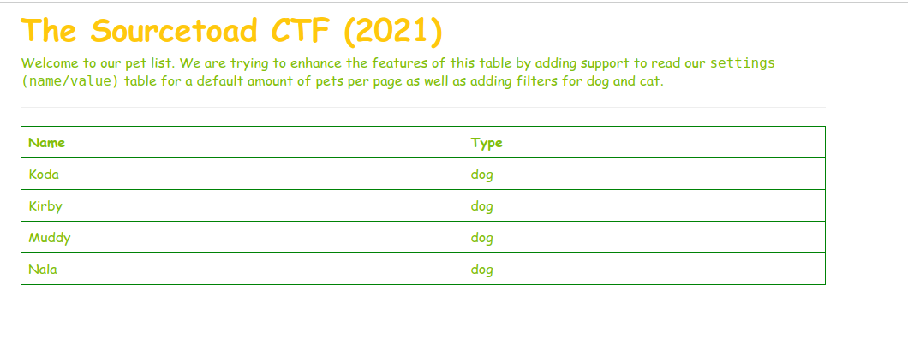
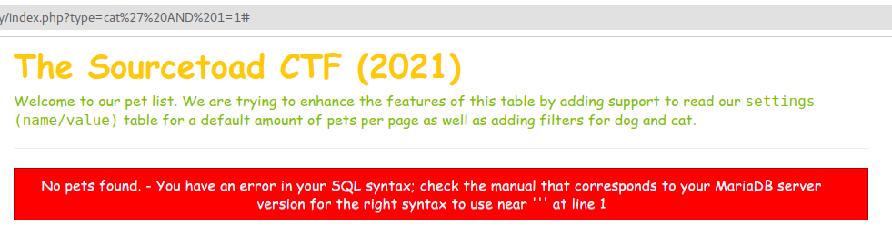
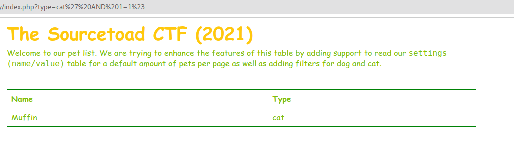
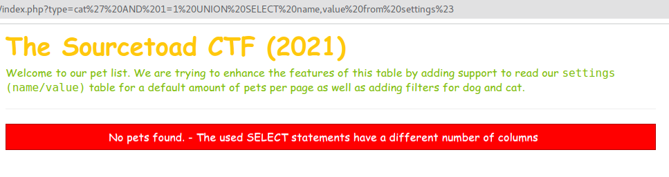
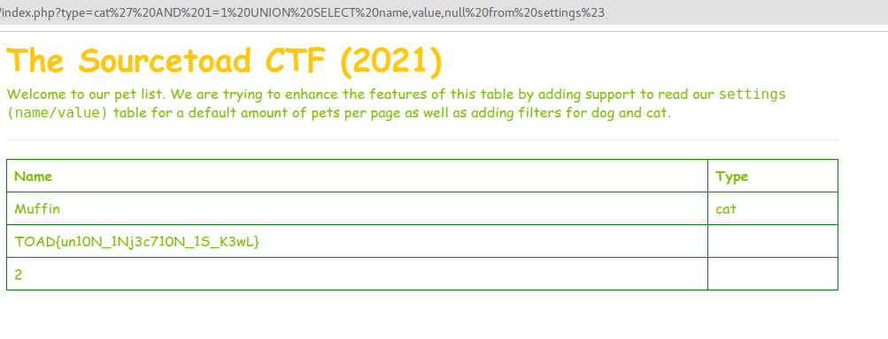

# Challenge 17 (Meldy) Solve

* Category - Web
* Difficulty - Very Hard

* This challenge loaded a table with an automatic query parameter of `type=dog` in the URL.
  * Initial tests showed that changing `dog` would affect the results returned in the query
* It became obvious this was another attempt at a SQL Injection with a twist
* Instead of us trying to break past a check in gate, we are trying to extract information
* Thankfully a hint exists in the description telling us about the `settings` table.
* So our goal is to properly merge the results of the `settings` table into this.
---
* So a preferred method of SQL Injection is to start small. Lets try and add something like:
  * `?type=cat' AND 1=1`
* This should end the existing query and add `AND 1=1#` which is true.
* This failed immediately

* However, this looks like we just forgot that a URL is in play here vs a form submission.
  * A `#` sign means something else to the URL, so we should probably encode that as `%23`

* Sure enough, that worked. So now we know we can inject. Lets grow on that last query
and join in the `settings` table.
* `?type=cat' AND 1=1 UNION SELECT name,value from settings%23`

* This failed again, but a different error!
* The error we have now is interesting. It says we are joining a different amount of columns.
* We know from the description that `settings` has two columns of `name`, `value`.
* So its presumed the `pets` table has more than two.
* SQL has a wonderful trick of just requesting `null` in a `SELECT` for a query.
* `?type=cat' AND 1=1 UNION SELECT name,value,null from settings%23`

* So after a slow trial and error. It appears we joined the results together.
* Our code isn't perfect as the result set looks odd due to the `null` injection, but it works. The flag is in
plaintext.

---
* You are left with the flag - `TOAD{un10N_1Nj3c710N_1S_K3wL}`.