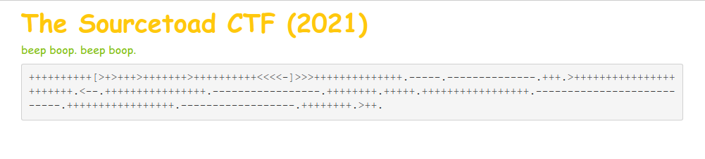
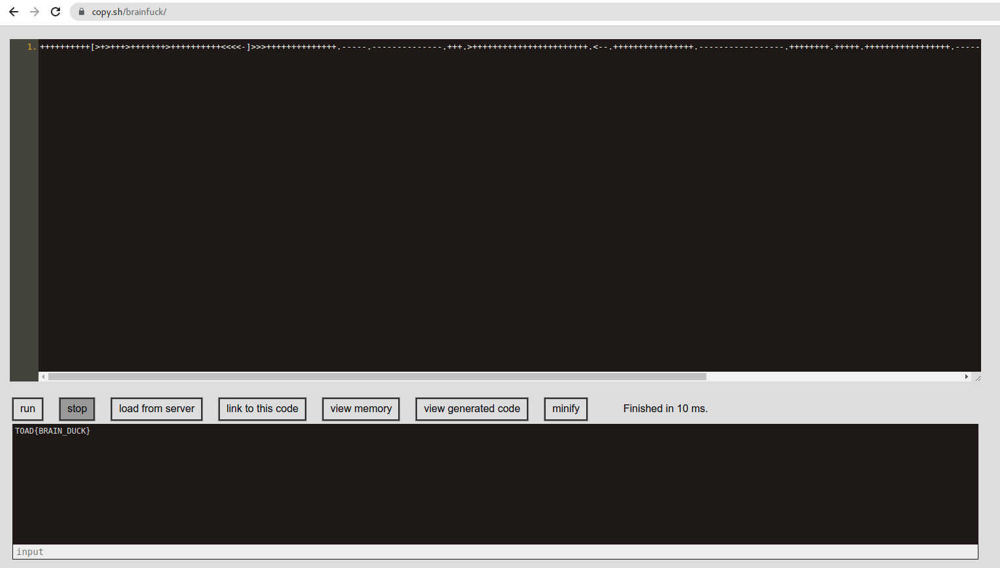

# Challenge 18 (Brainy) Solve

* Category - File/Text
* Difficulty - Normal

* This challenge has a little snippet of some random characters. However, based on the name of the challenge: `Brainy`
and the fact that all characters are the same set.
* It's probably true that this is [Brainfuck](https://en.wikipedia.org/wiki/Brainfuck)
* So a quick Google search for `Brainfuck online compiler`

* That compiled instantly and left us with the flag.

---
* You are left with the flag - `TOAD{BRAIN_DUCK}`.