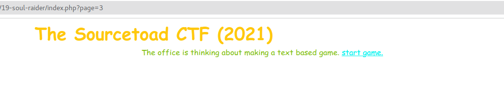
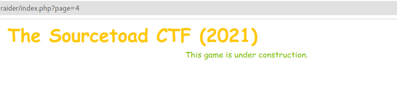
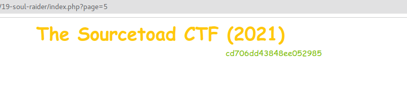
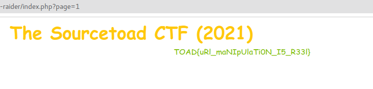

# Challenge 19 (Soul Raider) Solve

* Category - Web
* Difficulty - Easy



* This challenge when loading automatically redirected to a `index.php?page=3` page.
* It mentioned a text based game with a link to "start game".
* Before doing any digging, lets just click the link.



* We are now on `page=4` with this new message. So URL manipulation seems to be an easy thing.



* Page 5 dumped some unknown characters which perhaps paired with something leads to the flag.
* Checking the page source

```html

<!DOCTYPE html>
<html lang="en">
<head>
    <meta charset="utf-8">
    <link rel="stylesheet" href="../../common/bootstrap.min.css"/>
    <title>Challenge 19 (SoulRaider)</title>
</head>
<script>
</script>
<body>
<div class="container">
    <h2>The Sourcetoad CTF (2021)</h2>
    <div class="text-center">
        cd706dd43848ee052985
    </div>
</div>
</body>
</html>
```

* Nothing here looks related the key and then after refreshing the random characters changed!
* This is an easy challenge, so it probably has nothing to do with collecting random strings.
* So looking back at the URL, we see we started on `page=3`.
* What about `page=2`?
  * It appears to be the same as page 1.
* What about `page=1`?



* That has discovered the flag with some simple URL changes.

---
* You are left with the flag - `TOAD{uRl_maNIpUlaTi0N_I5_R33l}`.