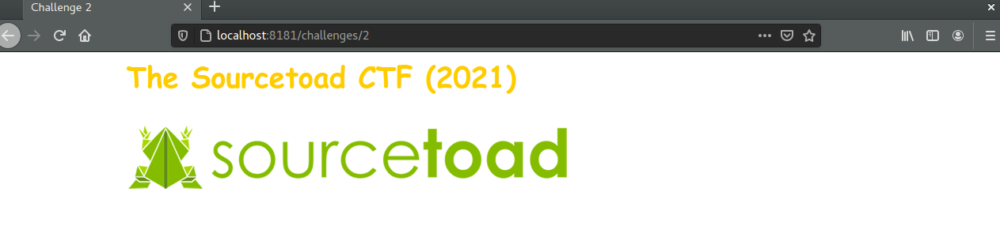
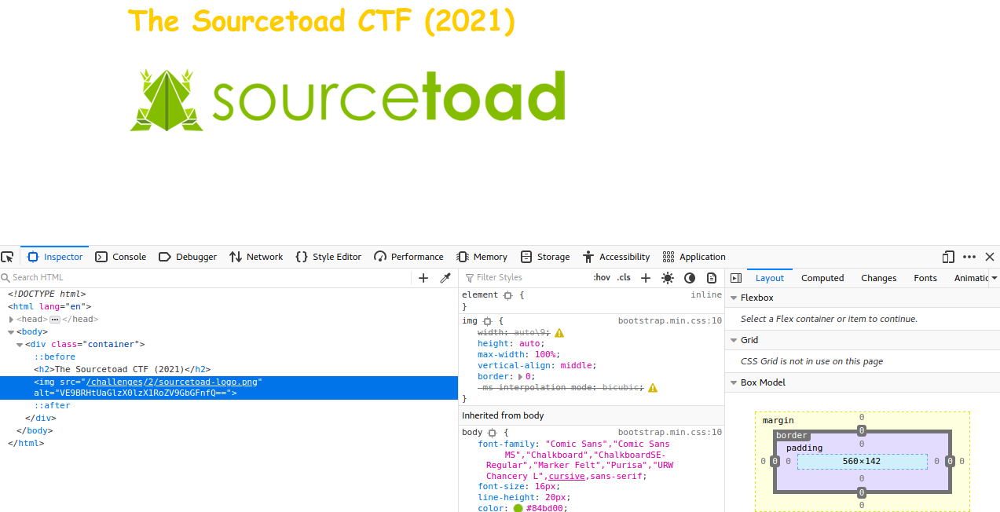

# Challenge 2 (Alty) Solve

 * Category - Web
 * Difficulty - Easy

---

 * This challenge was a warm up with only an image on the page
 

 * There was an interesting `alt` tag attached to this image
 * This could be obtained via page source, console tab or even hovering the image
 * The trailing `==` makes this quite obvious its Base64.
   * `echo "VE9BRHtUaGlzX0lzX1RoZV9GbGFnfQ==" | base64 --decode`
     * A simple collection of tools to decode the base64

---

 * You are left with the flag - `TOAD{This_Is_The_Flag}`.