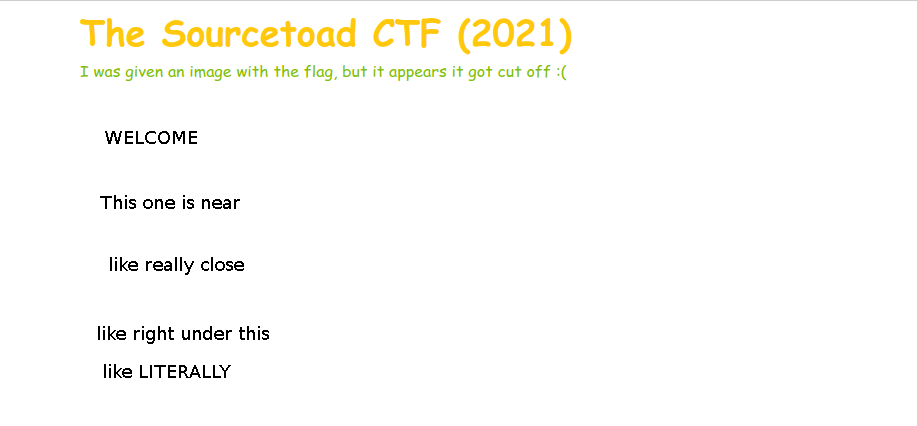
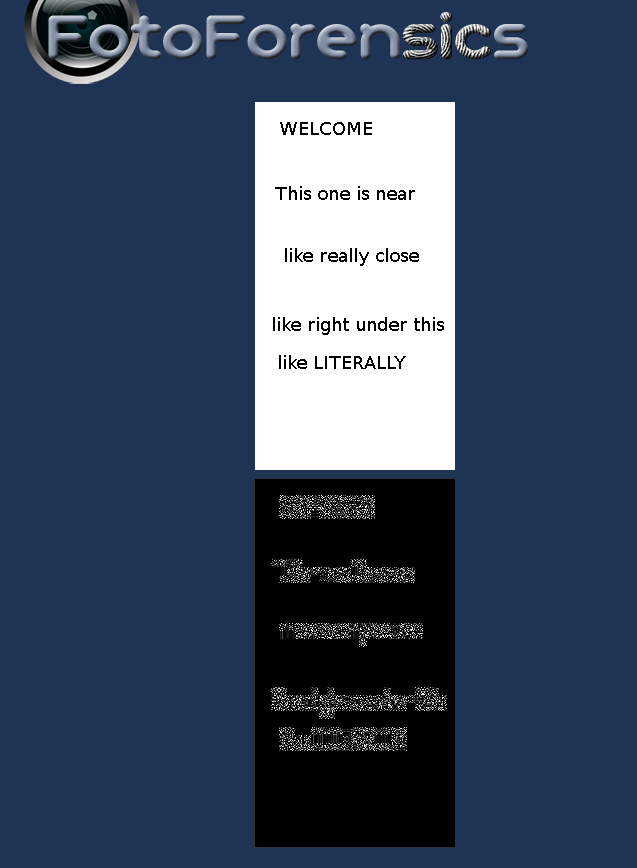
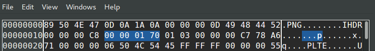
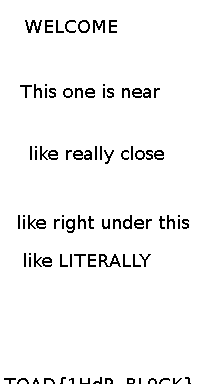
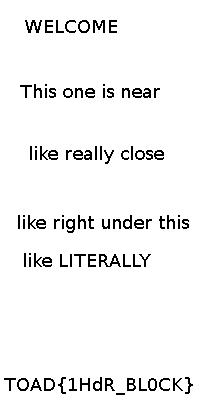

# Challenge 20 (Short or Tall) Solve

* Category - Steganography
* Difficulty - Very Hard



* This is a Steganography challenge at "Very Hard" with an image we see above.
* This image suggests that the flag is under the image.
* So lets check the HTML page for whatever is under it.

```html

<!DOCTYPE html>
<html lang="en">
<head>
	<meta charset="utf-8">
	<link rel="stylesheet" href="../../common/bootstrap.min.css"/>
	<title>Challenge 20 (Short or Tall)</title>
</head>
<body>
<div class="container">
	<h2>The Sourcetoad CTF (2021)</h2>
	<p>
		I was given an image with the flag, but it appears it got cut off :(
	</p>
	<br />
	
</div>
</body>
</html>
```

* So we see nothing but the base64 of the image.
* Since the category is Steganography, the flag is probably in the image itself.
* So can look at the `file` command to see what is going on.

```
➜  file challenge20.png 
challenge20.png: PNG image data, 200 x 368, 1-bit colormap, non-interlaced
```

* This appears to be a 1-bit colormap, so we only have 2 colors possible.
* We should upload this image to [fotoforensics.com](http://fotoforensics.com/) and see what the shifted image looks like



* So it appears even swapping contrast/colors, nothing is showing up.
* So we might need to check [pngcheck](https://man.cx/pngcheck(1))

```
➜  pngcheck -v challenge20.png
File: challenge20.png (1104 bytes)
  chunk IHDR at offset 0x0000c, length 13
    200 x 368 image, 1-bit palette, non-interlaced
  chunk PLTE at offset 0x00025, length 6: 2 palette entries
  chunk pHYs at offset 0x00037, length 9: 2835x2835 pixels/meter (72 dpi)
  chunk IDAT at offset 0x0004c, length 1008
    zlib: deflated, 16K window, maximum compression
  chunk IEND at offset 0x00448, length 0
No errors detected in challenge20.png (5 chunks, 88.0% compression).
```

* At this point we should look back at the challenge title "Short or Tall" and buy a hint.
* Buying a hint cost us 30 points, but we got `IHDR`
* So a quick Google search of [IHDR](http://www.libpng.org/pub/png/spec/1.2/PNG-Chunks.html)

```
4.1.1. IHDR Image header
The IHDR chunk must appear FIRST. It contains:

   Width:              4 bytes
   Height:             4 bytes
   Bit depth:          1 byte
   Color type:         1 byte
   Compression method: 1 byte
   Filter method:      1 byte
   Interlace method:   1 byte
```

* So this chunk in the PNG has to do with Width/Height.
* Now the challenge name of "short or tall" makes sense.
* If the image suggests the flag is under the image, lets grow the height.



* We can see after skipping 4 bytes after the `IHDR` block, we are at the location of the height
  * `00 00 01 70` - `368`
* So lets increase this just a bit
  * `00 00 01 80` - `384`
* However, the image is now failing the CRC check
  * `Fatal error reading PNG image file: IHDR: CRC error`
* So we should jump back to `pngcheck` and see what it says.

```
➜  pngcheck challenge20.png 
challenge20.png  CRC error in chunk IHDR (computed d2eabf68, expected c778a671)
ERROR: challenge20.png
```

* What is interesting about this output is it shows you what was computed vs expected.
* So if we open the hex editor again and look for `C7 78 A6 71`
* So we will swap this for - `D2 EA BF 68`

```
➜  pngcheck challenge20.png
OK: challenge20.png (200x384, 1-bit palette, non-interlaced, 88.5%).
```



* Now at `384` pixels height, we start seeing the flag!
* However, we can't be positive what some of the characters are.
* Since the width was `200`, it was probably a `400` height.
* So lets redo that entire section, but for changing `0x80` to `0x90` and then fixing the CRC.



* We now have the flag!

---
* You are left with the flag - `TOAD{1HdR_BL0CK}`.