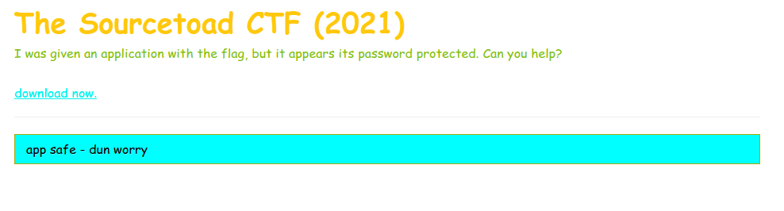
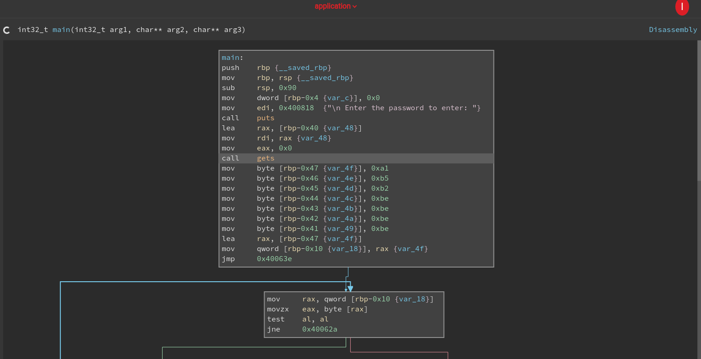
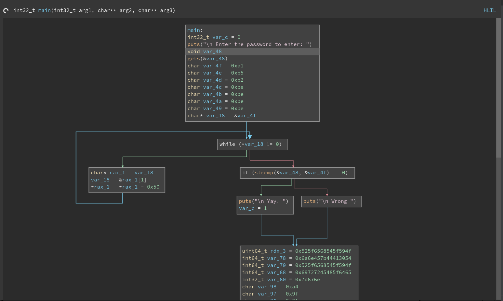

# Challenge 21 (SSBB) Solve

* Category - RE
* Difficulty - Very Hard



* This challenge appears to be our first reverse engineering challenge.
* We are given a webpage that immediately has a link to download a file.
* We can take a look with [file](https://linux.die.net/man/1/file) again.

```
➜  file application 
application: ELF 64-bit LSB executable, x86-64, version 1 (SYSV), dynamically linked, interpreter /lib64/ld-linux-x86-64.so.2, for GNU/Linux 2.6.32, BuildID[sha1]=496002f2484df39869039a45b2b2250369a7df24, not stripped
```

* So we could probably run [strings](https://linux.die.net/man/1/strings) again.

```
➜  Desktop strings application   
/lib64/ld-linux-x86-64.so.2
libc.so.6
gets
puts
printf
strcmp
__libc_start_main
__gmon_start__
GLIBC_2.2.5
T0AD{EnjH
OY_The_RH
ed_HErriH
AWAVA
AUATL
...
```

* It looks like we got it with `T0AD{EnjOY_The_Red_HErring}`
* However, that is rejected during entry :(
* As the name suggests, it was a false flag.
* So lets actually run the app.

```
➜  ./application 

 Enter the password to enter: 
test

 Wrong  
```

* The application seems simple. It asks for a password, then rejects you or presumably gives a flag.
* At this point, I want to try this application out with [BinaryNinja](https://binary.ninja/)



* The cool thing about this program is above we can see a regular disassembly, but we can ask BinaryNinja
to use a more code-like view. Its known as [HLIL](https://docs.binary.ninja/dev/bnil-mlil.html) to make the output
look more readable.



* So what is drawing my attention is the [gets function](https://stackoverflow.com/a/4309845/455008) which after a quick
Google search is not secure. This function does not know how much text you can read, so it can overflow.
* We can see from the above disassembly that during the if statement between `Yay` and `Wrong` we can see a variable
being set (`var_c=1`). So if there is a variable being set right after `gets`. We could get away with entering a very
long password and it might overflow to that variable and thus be true.
* This is regardless of us knowing the password.
* This is more known as [Stack Smashing](https://stackoverflow.com/q/40416516/455008), so we should try slightly longer strings for a different output.

```
➜  ./application

 Enter the password to enter: 
ddddddddddddddddddddddddddddddddddddddddddddddddddddddddddddddddddd

 Wrong 
TOAD{ov3Rfl0W_TH3_r1v3r}
```

* That did it!

---
* You are left with the flag - `TOAD{ov3Rfl0W_TH3_r1v3r}`.