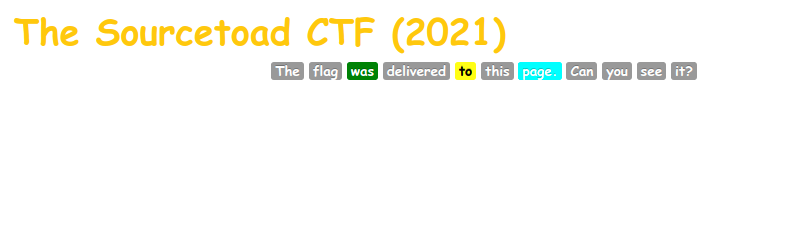

# Challenge 22 (4229) Solve

* Category - Web
* Difficulty - Medium



* This challenge has a pretty empty web page with some interesting badges.
* So lets peek at the HTML.

```html
<!DOCTYPE html>
<html lang="en">
<head>
    <meta charset="utf-8">
    <link rel="stylesheet" href="../../common/bootstrap.min.css"/>
    <title>Challenge 22 (4229)</title>
</head>
<script>
</script>
<body>
<div class="container">
    <h2>The Sourcetoad CTF (2021)</h2>
    <div class="text-center">
        <span class="label label-default">The</span>
        <span class="label label-primary">flag</span>
        <span class="label label-success">was</span>
        <span class="label label-default">delivered</span>
        <span class="label label-warning">to</span>
        <span class="label label-default">this</span>
        <span class="label label-info">page.</span>
        <span class="label label-default">Can</span>
        <span class="label label-danger">you</span>
        <span class="label label-default">see</span>
        <span class="label label-default">it?</span>
    </div>
</div>
</body>
</html>
```

* This page does look pretty bland without anything.
* However, "The flag was delivered to this page."
* Lets use curl so we can get all the headers and raw HTTP information.

```
➜  curl -I https://[redacted]/challenges/22-4229/
HTTP/1.1 200 OK
Server: nginx/1.20.0
Date: Thu, 07 Oct 2021 10:12:51 GMT
Content-Type: text/html; charset=UTF-8
Connection: keep-alive
X-Powered-By: PHP/7.4.21
X-Cat-Dog: TOAD{s0_h77P_h34D3rs-r-K3Wl}
```

 * This was easier than I thought. The flag appears to be sitting on an HTTP Header (`X-Cat-Dog`)

---
* You are left with the flag - `TOAD{s0_h77P_h34D3rs-r-K3Wl}`.