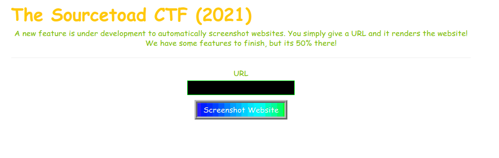
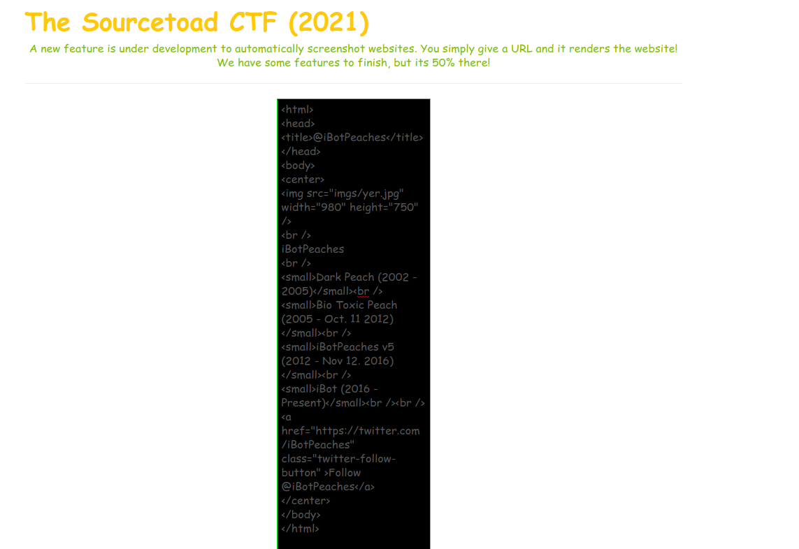
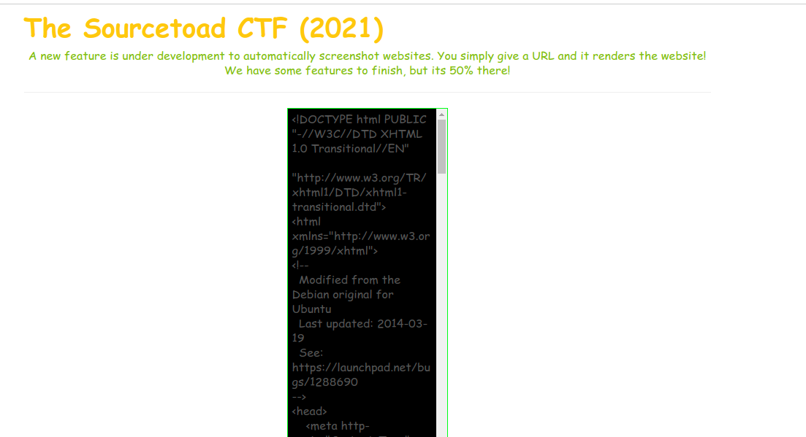
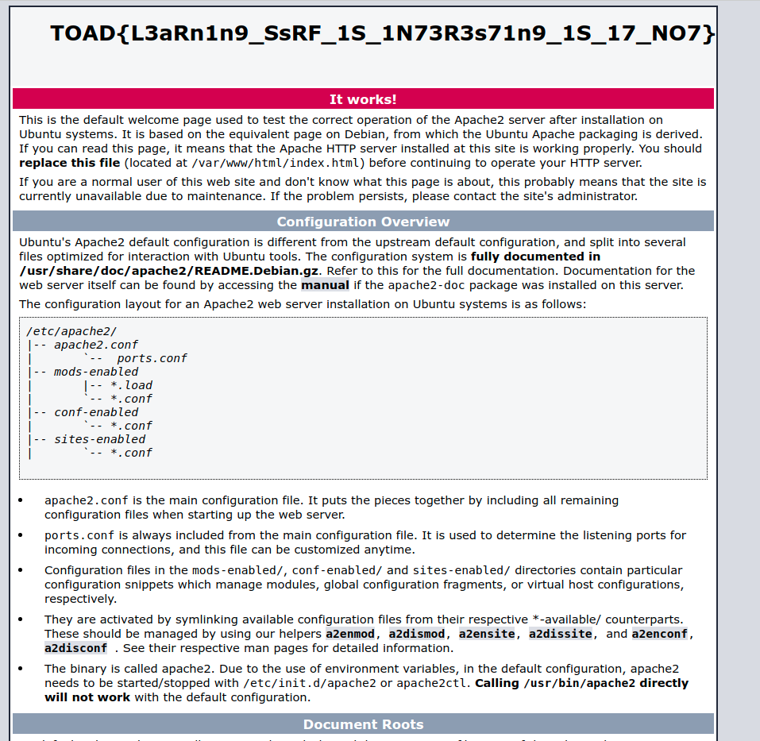

# Challenge 23 (The Borg) Solve

* Category - Web
* Difficulty - Hard



 * This challenge appears to be another web one with an input box.
 * Instead of having a username/password - it appears this just screenshots the website you enter.
   * Well actually, it just downloads text for now.
 * Lets test one of my own sites `ibotpeaches.com`



 * So it appears this just reaches out and downloads the site.
 * This is user input, so we could effectively let this server download and return whatever we want.
 * This is kinda like an [CSRF](https://thehackedsite.netlify.app/bug/bounty/2021/03/27/csrf-and-ssrf), but for the server. So an SSRF
 * We could peek around the internal network from this endpoint.
 * Lets try the loopback - `http://127.0.0.1` in hopes of finding some internal health service.



 * That worked!
 * We got some internal page of a ton of text. Lets save this and render the output.



 * Sure enough, that was it.
 * We just had to trick the server into downloading a normally internal resource and attempt to return it.
 * So lets try this URL from the internet.

```
➜  ~ curl -I https://[redacted].com/                   
HTTP/1.1 403 Forbidden
Server: nginx/1.20.0
Date: Thu, 07 Oct 2021 11:36:41 GMT
Content-Type: text/html
Content-Length: 153
Connection: keep-alive
```

* Yep, 403 as predicted. So we used this vulnerable application to jump that protection into tricking the server
to return that webpage & flag.

---
* You are left with the flag - `TOAD{L3aRn1n9_SsRF_1S_1N73R3s71n9_1S_17_NO7}`.