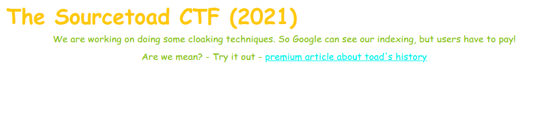

# Challenge 24 (Cloaking) Solve

* Category - Web
* Difficulty - Medium



* This challenge started off with a description that a paywall would exist for users, but not Google
* If we click the link, we are met with an error.


* For my own curiosity, lets also check the response code/headers.

```
➜  curl -I https://[redacted].com/challenges/24-cloaking/page.php
HTTP/1.1 402 Payment Required
Server: nginx/1.20.0
Date: Fri, 08 Oct 2021 10:22:59 GMT
Content-Type: text/html; charset=UTF-8
Connection: keep-alive
X-Powered-By: PHP/7.4.21
```

* We see HTTP 402 Payment Required which means we either have to pay or pretend we are Google.
* Pretending to be Google probably happens two different ways.
* We have a Referrer property from a Google search result page or a Google User Agent.
* Lets start with a User Agent, but first we need to find one for Google so a quick [search](https://developers.google.com/search/docs/advanced/crawling/overview-google-crawlers).

```html
➜  Desktop curl -H "User-Agent: Googlebot" https://[redacted].com/challenges/24-cloaking/page.php 
<!DOCTYPE html>
<html lang="en">
<head>
    <meta charset="utf-8">
    <link rel="stylesheet" href="../../common/bootstrap.min.css"/>
    <title>Challenge 24 (Cloaking)</title>
</head>
<script>
</script>
<body>
<div class="container">
    <h2>The Sourcetoad CTF (2021)</h2>
    <div class="text-center">
            <div class="alert alert-info">Welcome User!</div>
    <div class="alert alert-success">TOAD{50-Y0u'v3-83c0M3-9009L3}</div>
    </div>
</div>
</body>
</html>%
```

* Now we got a HTTP 200 with the flag returned.

---
* You are left with the flag - `TOAD{50-Y0u'v3-83c0M3-9009L3}`.