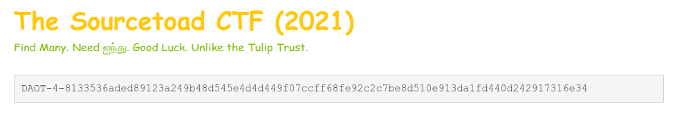

# Challenge 26 (Shamir) Solve

* Category - Cryptography
* Difficulty - Medium Hard



 * This challenge appears to be another in the form of cryptography
 * The challenge is named Shamir, which you probably recognize as the S in RSA
 * There is a language unrecognized (`ஐந்து`) which Google says stands for "5".
 * So a bit more of Googling finds [Shamir Secret Sharing](https://en.wikipedia.org/wiki/Shamir%27s_Secret_Sharing)
 * So then another Google to find an [online site](http://point-at-infinity.org/ssss/demo.html) for this.


* So now the description of this webpage makes sense. We must need to find 5 parts.
* The first is given.
* The HTML source has two (one binary and one plaintext), and references a `custom.css` file.

```css
.color-green {
    content: 'DAOT-1-5ea0702f05fc4e63f31073bd9c9c55a84f09bac7e130f90289c11cadf858bc78a8279a02f13873a47756'
}
```

* Which of course has another part.
* So we need one more still.
* Lets try `curl -I` again.

```
➜  ~ curl -I https://[redacted]/challenges/26-shamir/
HTTP/1.1 200 OK
Server: nginx/1.20.0
Date: Mon, 11 Oct 2021 23:58:17 GMT
Content-Type: text/html; charset=UTF-8
Connection: keep-alive
X-Powered-By: PHP/7.4.21
X-Part: DAOT-2-e171241ba4458f7f24d5e80d4b80803348817693f2358867e5c0bc4eaf7d63b96ec740277a14b587c2de
Set-Cookie: another-part=DAOT-3-27c216ee602e009f857b442ac4d029184739429fd1e81cdf24781dd79533d97766c0bc0d28dd8cc8d373
```

* We found two more there!
* We have enough to recombine


* There we got the flag!

---
* You are left with the flag - `TOAD{5H4M1R-53CR375-4R3-CL3V3r-L1k3-4-PUn}`.