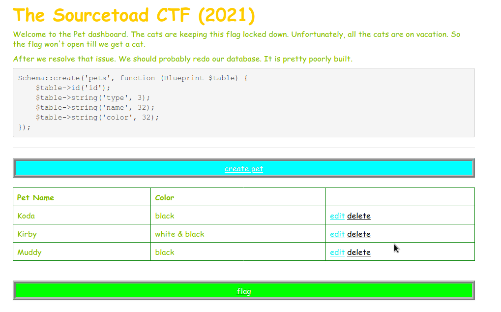
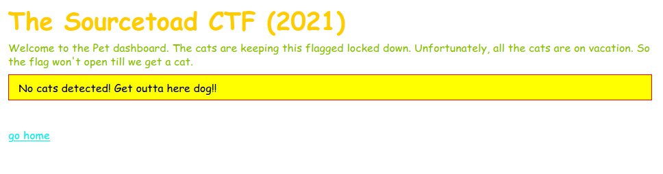
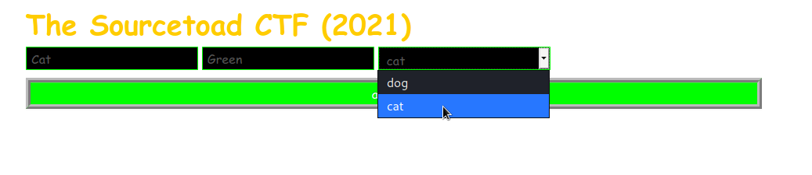
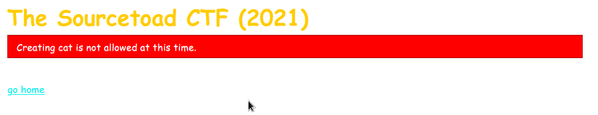
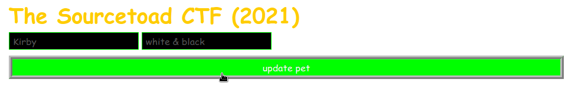
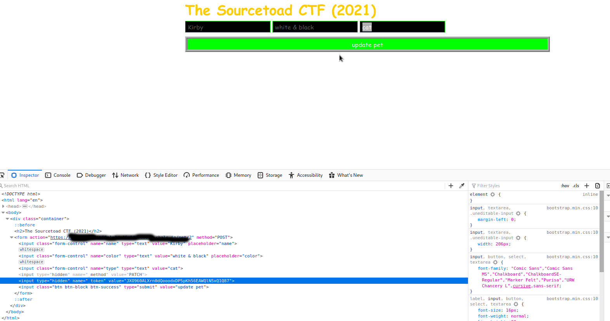
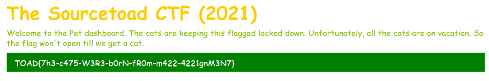

# Challenge 27 (Mass Effect) Solve

* Category - Laravel
* Difficulty - Very Hard



 * This is another Laravel challenge with what appears to be a Pet CRUD system.
 * Clicking around I can make pets, delete pets, edit pets and more.
 * I can even click the link for the flag without doing anything.



 * However, it is left with an error saying that No cats are detected.
 * Well, this is easy. I saw we can just create a cat.
 * So just head to the create page and make one.



 * Unfortunately, it would not be that easy.



 * So if we can't create a cat, maybe we can edit a dog to a cat.



 * So the edit page has a bit of a hiccup. There is no "type" field
 * So can't exactly edit it to convert this dog to a cat.
 * Might as well just edit the HTML and add a form element for `type`



 * So now we submit this and head on over to the flag to see if it persisted.



 * So it did!
 * So lets look back at why this worked.

```php
    public function update(Request $request, Pet $pet)
    {
        $pet->fill($request->all());
        $pet->saveOrFail();

        return redirect('/');
    }
```

 * So you can tell whatever value is posted is attempted to be filled on the `Pet` model.
 * So if we look at the model itself we can see why this works.

```php
class Pet extends Model
{
    use HasFactory;

    public $timestamps = false;

    public $guarded = [];
}
```

 * We can see nothing is `$guarded` so any value that also exists on the model would work.
 * [Laravel docs](https://laravel.com/docs/8.x/eloquent#mass-assignment) even tell you about this vulnerability.

> A mass assignment vulnerability occurs when a user passes an unexpected HTTP request field and that field changes a column in your database that you did not expect. For example, a malicious user might send an is_admin parameter through an HTTP request, which is then passed to your model's create method, allowing the user to escalate themselves to an administrator.

 * So we can look back above and see we got the flag and understand why it works.
---
* You are left with the flag - `TOAD{7h3-c475-W3R3-b0rN-fR0m-m422-4221gnM3N7}`.