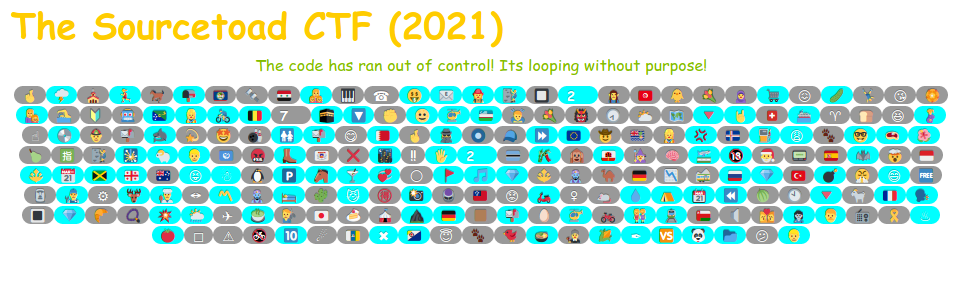
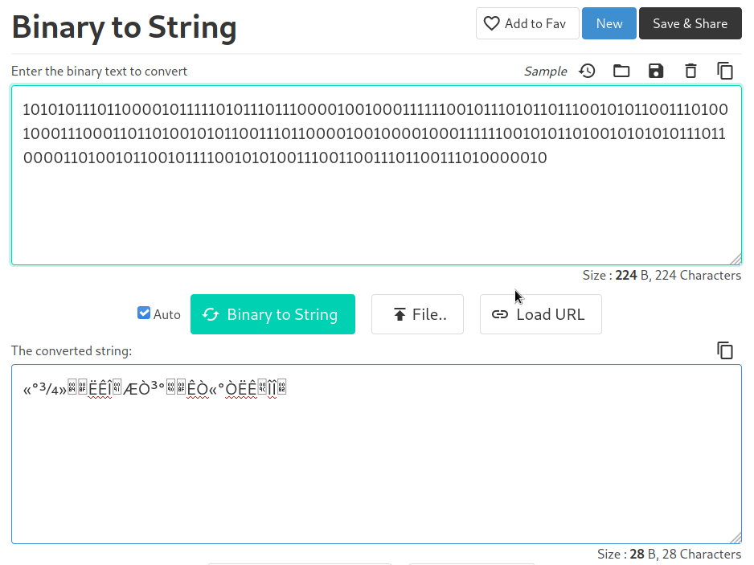
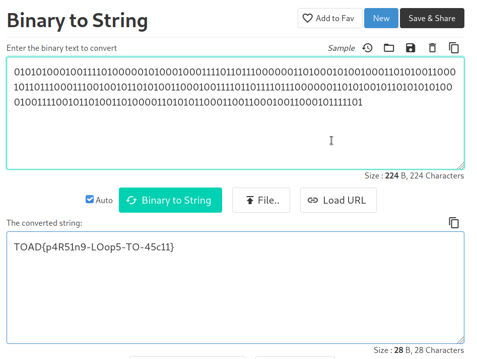

# Challenge 28 (Loopie) Solve

* Category - Web
* Difficulty - Hard



 * This challenge was pretty interesting at first glance. It seemed on every refresh the emojis changed.
 * I kept refreshing over and over and started to notice that while the emojis changed, the background
on the emojis never changed.
 * So it was consistently gray, blue, gray blue etc
 * So lets peek the HTML

```html
<!DOCTYPE html>
<html lang="en">
<head>
    <meta charset="utf-8">
    <link rel="stylesheet" href="../../common/bootstrap.min.css"/>
    <script src="https://code.jquery.com/jquery-3.6.0.min.js" integrity="sha256-/xUj+3OJU5yExlq6GSYGSHk7tPXikynS7ogEvDej/m4=" crossorigin="anonymous"></script>
    <title>Challenge 28 (Loopie)</title>
</head>
<body>
<div class="container">
    <h2>The Sourcetoad CTF (2021)</h2>
    <div class="text-center">
        <p>
            The code has ran out of control! Its looping without purpose!
        </p>
        ...
    </div>
</div>
</body>
</html>
```

* Interesting to see that jQuery is pre-included.
* So we could leverage that to foreach all little badges and treat them as 0/1 to form a binary string.
* So easy enough.

```
var fullString = '';
$(".badge").each(function () {
    fullString = fullString.concat($(this).hasClass('badge-danger') ? '1' : '0')
});
console.log(fullString);
10101011101100001011111010111011100001001000111111001011101011011100101011001110100100011100011011010010101100111011000010010000100011111100101011010010101010111011000011010010110010111100101010011100110011101100111010000010
```

 * So now lets just decode this back to a string.



 * It appears this is wrong, so lets just try checking `info` instead of `danger` in case we guessed wrong on 0 vs 1.



 * There we go!

---

* You are left with the flag - `TOAD{p4R51n9-LOop5-TO-45c11}`.