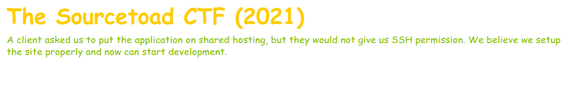
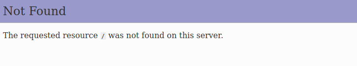
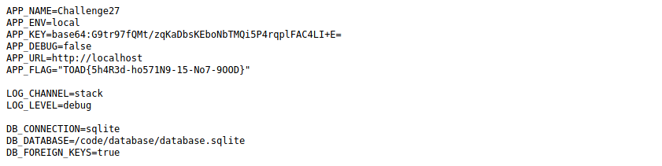

# Challenge 29 (Shared Hosting) Solve

* Category - Laravel
* Difficulty - Medium

* This challenge launched with a very basic Laravel application being installed in shared hosting.
* From memory, installing Laravel in shared hosting is pretty difficult because Laravel wants the `public`
folder accessible to the web and nothing else.
* So if this challenge is as easy, we should just remove `/public` from the URL and get a listing of files.

* This didn't work as intended, but lets try some files we know will exist in a Laravel application
* The environment file used `.env` is probably a good bet.

* Sure enough, that worked and we got access to a file that is normally not accessible.
* In the [dotenv](https://github.com/vlucas/phpdotenv) was the flag.

---

* You are left with the flag - `TOAD{5h4R3d-ho571N9-15-No7-9OOD}`.