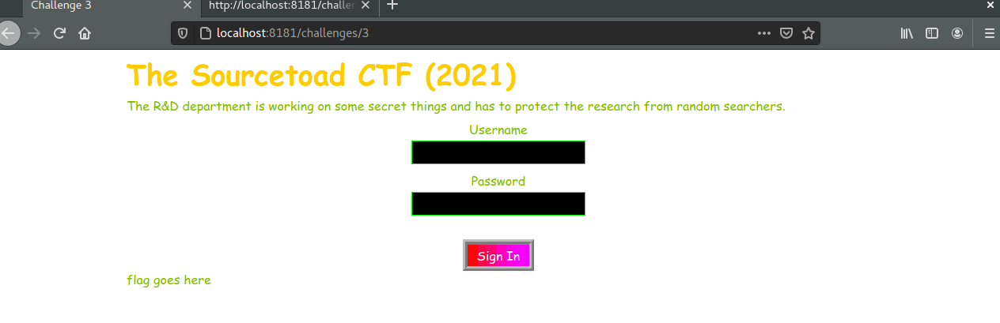
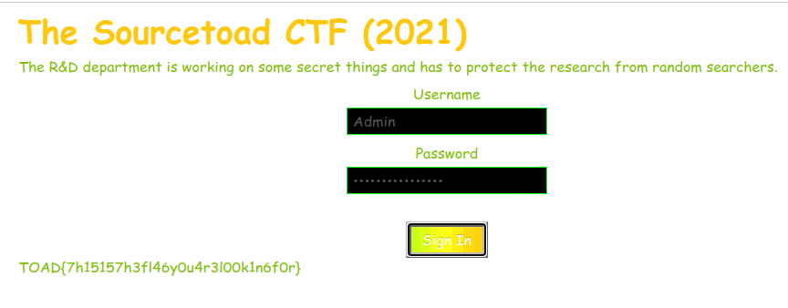

# Challenge 2 Solve

 * Category - Web
 * Difficulty - Easy



---

 * This challenge was the intro to understanding client driven code.
 * Simply hitting submit just updated the `Flag goes here` message with `:( - Whoops`
 * So it was time to peek the page source.

---
```javascript
    <script>
        var username = document.getElementById("username");
        var password = document.getElementById("password");
        var cipherText = "Maq6O33eeZ3ILYlbrP3WS/yfiPzm9GFRcZCZezuF7V/sIE/v"

        function check() {
            if (username.value === "Admin" && atob(password.value) === "s3kr1tP@ss") {
                var key = '';
                for (var i = 0; i <= password.value.length; i++) {
                    key += password.value.charAt(i)
                }
                var flag = Tea.decrypt(cipherText, key);
                document.getElementById("flag").innerText = flag;
            } else {
                document.getElementById("flag").innerText = ':( - Whoops';
            }
        }

    </script>
```

 * There was two interesting things here. It appears the username is `Admin`
 * The password is ultimately `s3kr1tP@ss`, but it is not compared to that directly.
   * It is compared to the output of [atob](https://developer.mozilla.org/en-US/docs/Web/API/atob) (decodes base64)
   * We can encode that string into base64
     * `echo "s3kr1tP@ss" | base64` = `czNrcjF0UEBzcw==`
 * Now we can also see through some confusion that whatever is entered into the password box is used as the key for a basic [TEA](https://en.wikipedia.org/wiki/Tiny_Encryption_Algorithm) (Tiny Encryption Algorithm) disassembling.
 * So while you could attempt to crack the TEA encoded payload, it seems simpler to simply do some base64 work


---

 * You are left with the flag - `TOAD{7h15157h3fl46y0u4r3l00k1n6f0r}`.