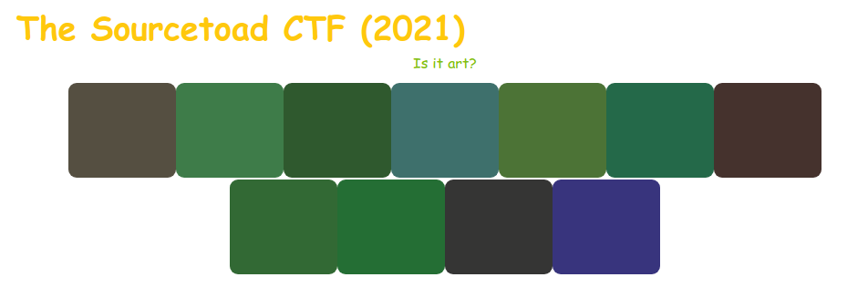

# Challenge 31 (Colours) Solve

* Category - Medium
* Difficulty - Web



 * This challenge appeared to be quite small. The entire HTML source didn't have much.

```
<!DOCTYPE html>
<html lang="en">
<head>
    <meta charset="utf-8">
    <link rel="stylesheet" href="../../common/bootstrap.min.css"/>
    <title>Challenge 31 (Colours)</title>
</head>
<body>
<div class="container">
    <h2>The Sourcetoad CTF (2021)</h2>
    <div class="text-center">
        <p>
            Is it art?
        </p>
        <div class="badge" style="width: 100px; height: 100px; background-color: #544f41">&nbsp;</div><div class="badge" style="width: 100px; height: 100px; background-color: #447b48">&nbsp;</div><div class="badge" style="width: 100px; height: 100px; background-color: #33582d">&nbsp;</div><div class="badge" style="width: 100px; height: 100px; background-color: #436f6c">&nbsp;</div><div class="badge" style="width: 100px; height: 100px; background-color: #4f7235">&nbsp;</div><div class="badge" style="width: 100px; height: 100px; background-color: #2d6849">&nbsp;</div><div class="badge" style="width: 100px; height: 100px; background-color: #44332d">&nbsp;</div><div class="badge" style="width: 100px; height: 100px; background-color: #376833">&nbsp;</div><div class="badge" style="width: 100px; height: 100px; background-color: #2d6d33">&nbsp;</div><div class="badge" style="width: 100px; height: 100px; background-color: #353534">&nbsp;</div><div class="badge" style="width: 100px; height: 100px; background-color: #39337d">&nbsp;</div>
    </div>
</div>
</body>
</html>
```

* The only thing that appears to be different in this entire file is the colors of each box.
* They all appear to have a different hex code.
* If we take the very first color (`#544f41`) and convert that back to ASCII we get `TOA`
  * This is the right path. The hex colors hold the flag.
* We could probably script this, but I only count 11 boxes. We can probably copy/paste faster than writing something
* We get `544f41 447b48 33582d 436f6c 4f7235 2d6849 44332d 376833 2d6d33 353534 39337d`
* Which converted back to ASCII is indeed the flag.

---

* You are left with the flag - `TOAD{H3X-ColOr5-hID3-7h3-m355493}`.