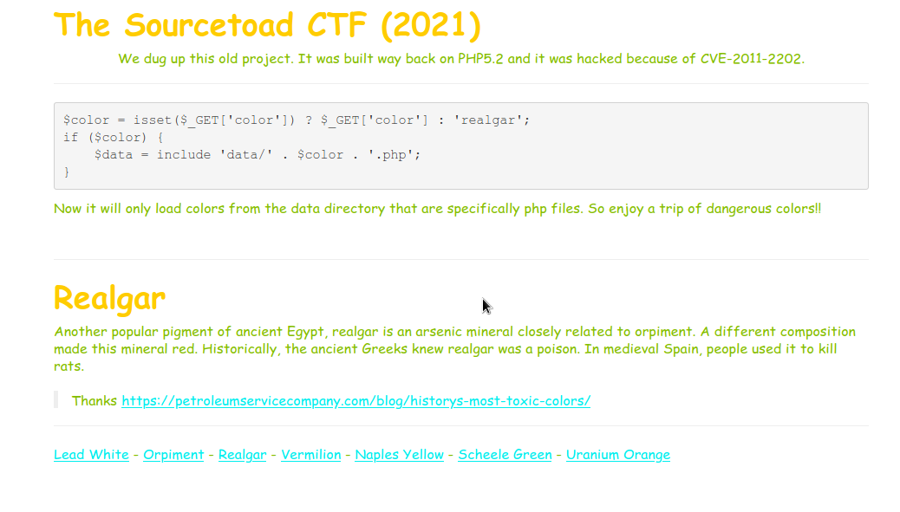
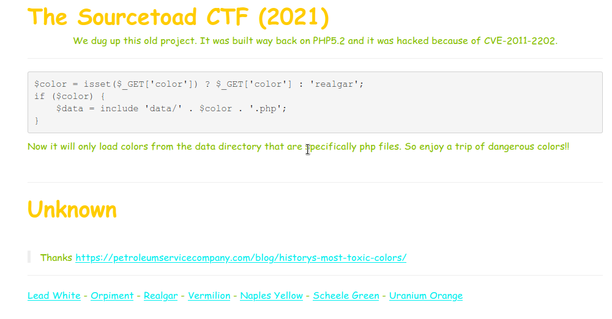
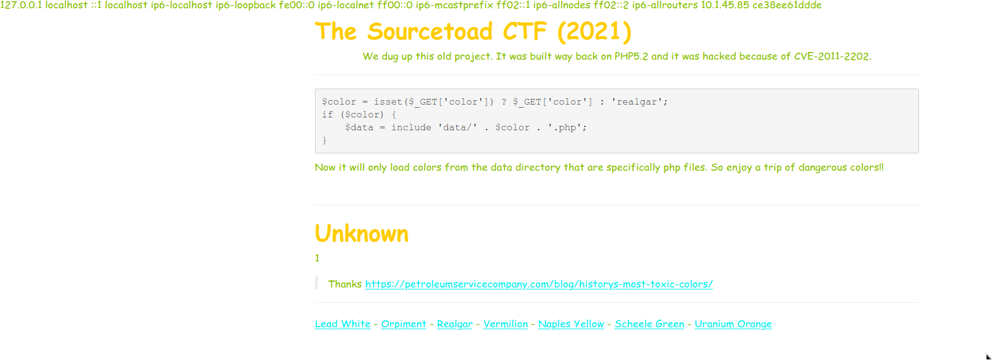
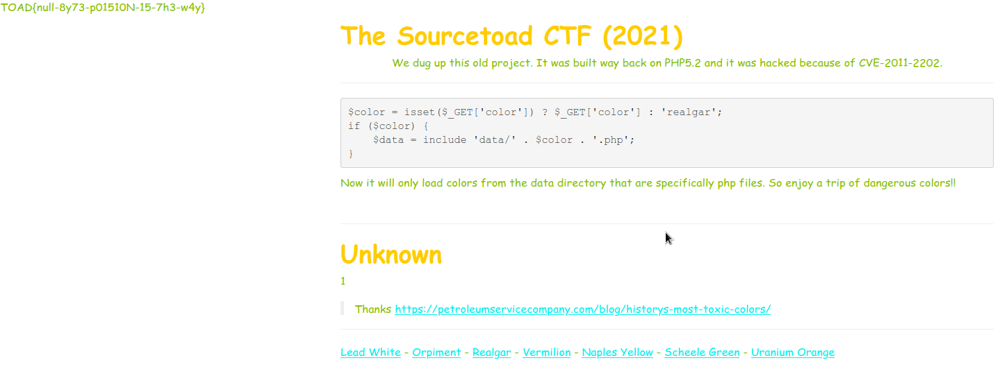

# Challenge 32 (Poison) Solve

* Category - Medium Hard
* Difficulty - Web



 * This challenge is a bit interesting, we get a large bit of information at once.
   * We see PHP5.2 is in use (wat)
   * We see CVE-2006-7243 was abused in the past.
   * We can load as many colors as appear in the footer
   * We can see a snippet of information of how this was patched.
 * We can see from the bellow line that untrusted user input is provided to load the color.

```php
$data = include 'data/' . $color . '.php';
```

* So we can see after clicking a color - `?color=naples_yellow` the query parameter `color` changes.
* However, seeing the code above - We know a forced `.php` extension is on every file.
* So if we try - `?color=/etc/hosts` - it does not work as we expect.



* So it must be time to look back at the information given. What is CVE-2006-7243?
* We can find a reference in the PHP Changelog
  * `Paths with NULL in them (foo\0bar.txt) are now considered as invalid (CVE-2006-7243).`
* So we know a `NULL` byte is in play here. The underlying C language for PHP, probably ends the string so we have a path to exploit
* Lets try `?color=/etc/hosts%00` - The `%00` = null byte.
* That did not work, but we have to remember we are trying path traversal mixed with a null byte.
* So lets just try `../` a few times until we give up or something changes.



* It only took 2 tries with - `?color=../../etc/hosts%00` to change the output.
* So much like the hints given in the beginning of the CTF, lets try `/flag`
* Which sure enough printed the output straight to the page.



---

* You are left with the flag - `TOAD{null-8y73-p01510N-15-7h3-w4y}`.