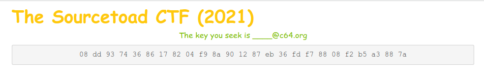
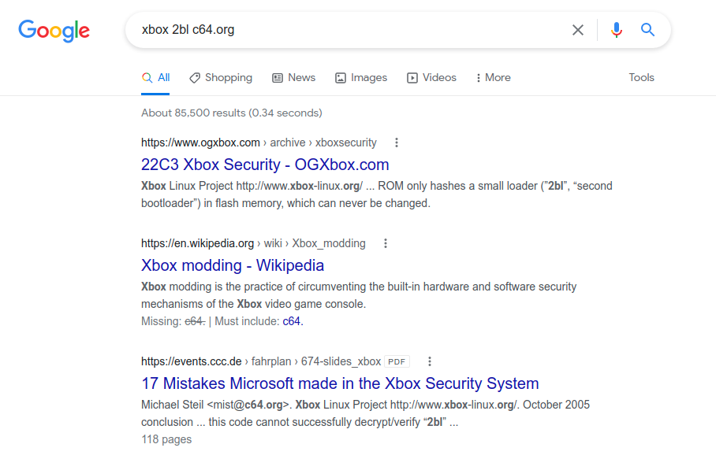
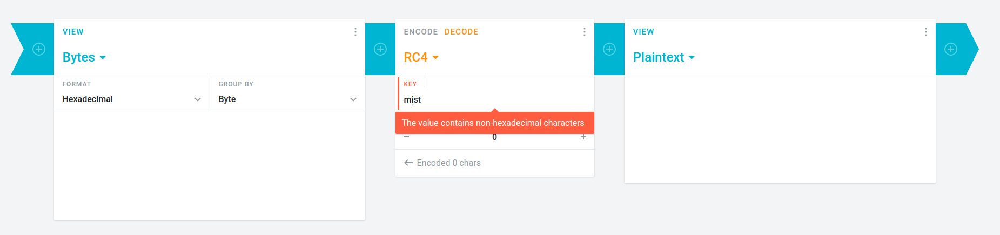
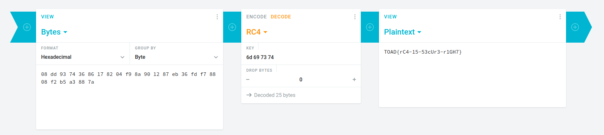

# Challenge 33 (Xbox 2BL) Solve

* Category - Normal
* Difficulty - Cryptography

 * This challenge looks to another meant to decode a collection of bytes.
 * It hints at Xbox 2BL and finding the username of an email.
 * So lets start with a simple Google search.

 * At this point on the first page of results we see `mist`, so that must be the key hinted at
 * So we need to know which algorithm is used for this challenge.
 * Continue reading `17 Mistakes Microsoft Made in the Xbox Security System` attached to that Google result was
the first step
 * There was a section in that document called "Second Bootloader (2bl)" which included a reference to the RC4
algorithm.
 * So lets head to [Cryptii](https://cryptii.com/)

 * Looks like a dumb error, lets convert `mist` to hex `6D 69 73 74`

 * There we go!
---

* You are left with the flag - `TOAD{rC4-15-53cUr3-r1GH7}`.