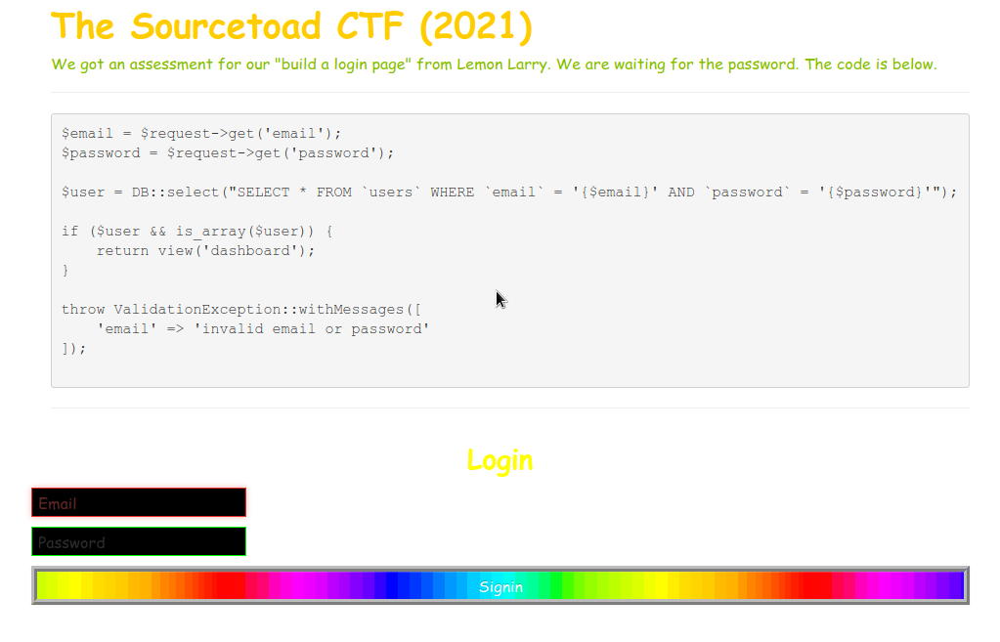
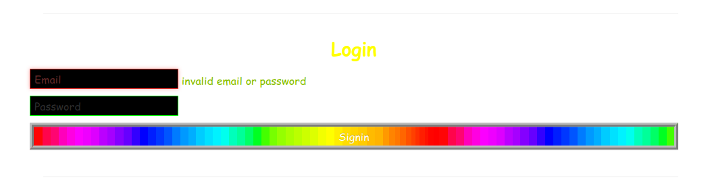

# Challenge 34 (W3 [Redacted]) Solve

* Category - Normal
* Difficulty - Laravel



* This challenge looks quite easy with a code snippet of the functionality as well as a login page.
* It takes just a few seconds to realize a SQL Injection is all that is needed here.
* Even though this is a Laravel framework, this code actively works against the protections built in.



* If we enter just a guess of username/password it fails immediately.
* If we take the query from the snippet above we can see

```sql
SELECT * FROM `users` WHERE `email` = '{$email}' AND `password` = '{$password}'
```
* So we should just be able to enter anything as the email and do like `password` as `' OR 1=1--`
* This will become

```sql
SELECT * FROM `users` WHERE `email` = 'test' AND `password` = '' OR 1=1--'
```
* Which is a valid SQL Injection to return all results.


* Sure enough that worked.

---

* You are left with the flag - `TOAD{w3-5cH00L5-734cH35-b4D}`.