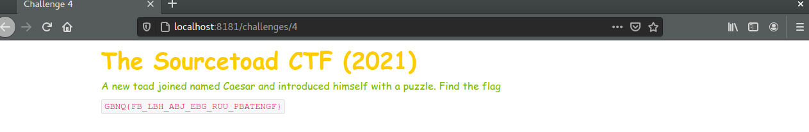
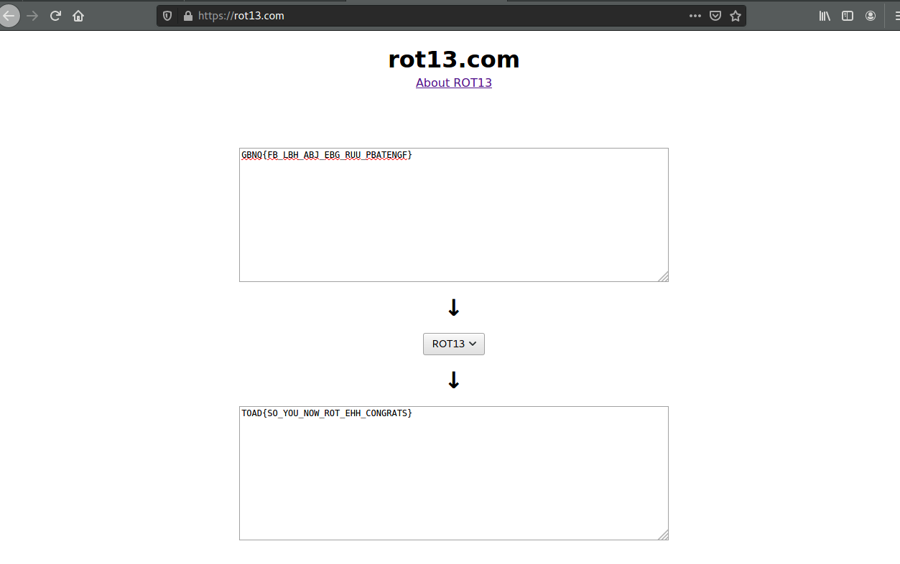

# Challenge 4 Solve

 * Category - Cryptography
 * Difficulty - Normal

---

 * This challenge was the intro to understanding a popular cipher hinted at from the description
 * "A toad named Caesar" was hinting at the Caesar Cipher
 * The string (`GBNQ{FB_LBH_ABJ_EBG_RUU_PBATENGF}`) looks already quite set, just the wrong characters.
 * Which isn't really a cipher, but just text shifting/rotating under ROT13
 * So basically you take a character and move it 13 characters down the alphabet.
 * To reverse it - you just reverse 13 characters.
 * You could probably bash this, but there is also `https://rot13.com` :)

---

---

 * You are left with the flag - `TOAD{SO_YOU_NOW_ROT_EHH_CONGRATS}`.