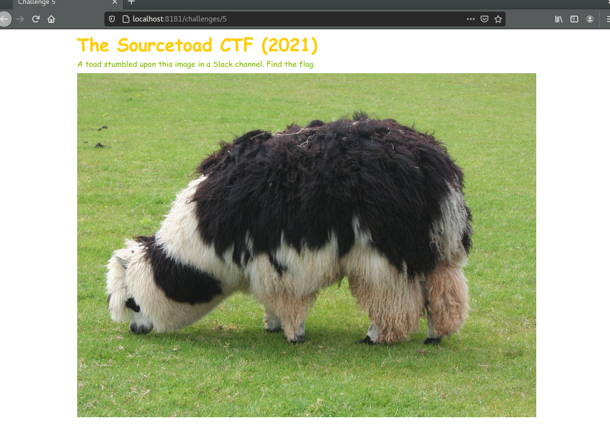
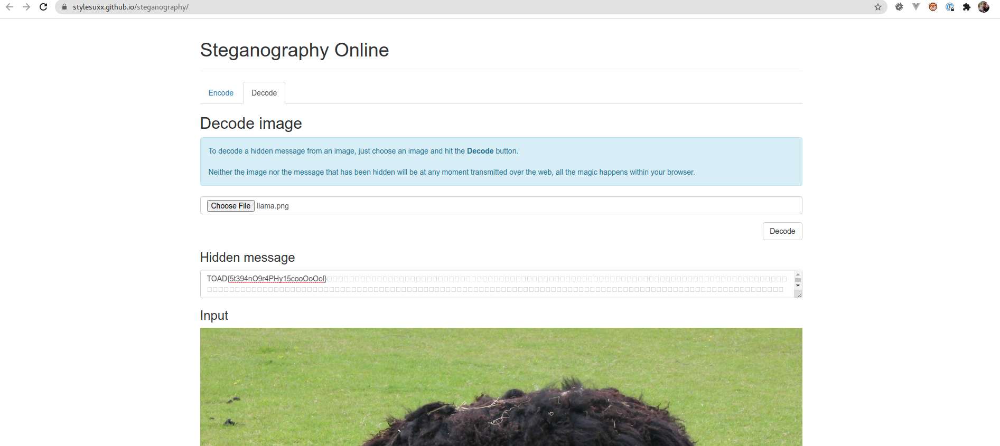

# Challenge 5 Solve

* Category - Steganography
* Difficulty - Medium



---

* This challenge was the intro to understanding common image techniques to hide information
* For all images that are immediately visible. I try two things right out of the gate.
* I dump the EXIF information and I peek the trailer of the image in a hex editor for injected plaintext.
* So using [exiftool](https://linux.die.net/man/1/exiftool) and dumping the details of this image we see:

```
➜  exiftool llama.png                         
ExifTool Version Number         : 10.10
File Name                       : llama.png
Directory                       : .
File Size                       : 4.1 MB
File Modification Date/Time     : 2021:10:03 06:54:17-04:00
File Access Date/Time           : 2021:10:03 06:54:17-04:00
File Inode Change Date/Time     : 2021:10:03 06:54:17-04:00
File Permissions                : rw-rw-r--
File Type                       : PNG
File Type Extension             : png
MIME Type                       : image/png
Image Width                     : 2000
Image Height                    : 1500
Bit Depth                       : 8
Color Type                      : RGB with Alpha
Compression                     : Deflate/Inflate
Filter                          : Adaptive
Interlace                       : Noninterlaced
SRGB Rendering                  : Perceptual
Software                        : https://stylesuxx.github.io/steganography/
Comment                         : Google Chrome
Image Size                      : 2000x1500
Megapixels                      : 3.0
```

* One key stands out `Software` which points to a Github.io page about steganography
* Another key looks interesting about `Comment` pointing to Google Chrome
* It must be hinting at using Google Chrome to go to that website.

---



---

* You are left with the flag - `TOAD{5t394nO9r4PHy15cooOoOol}`.