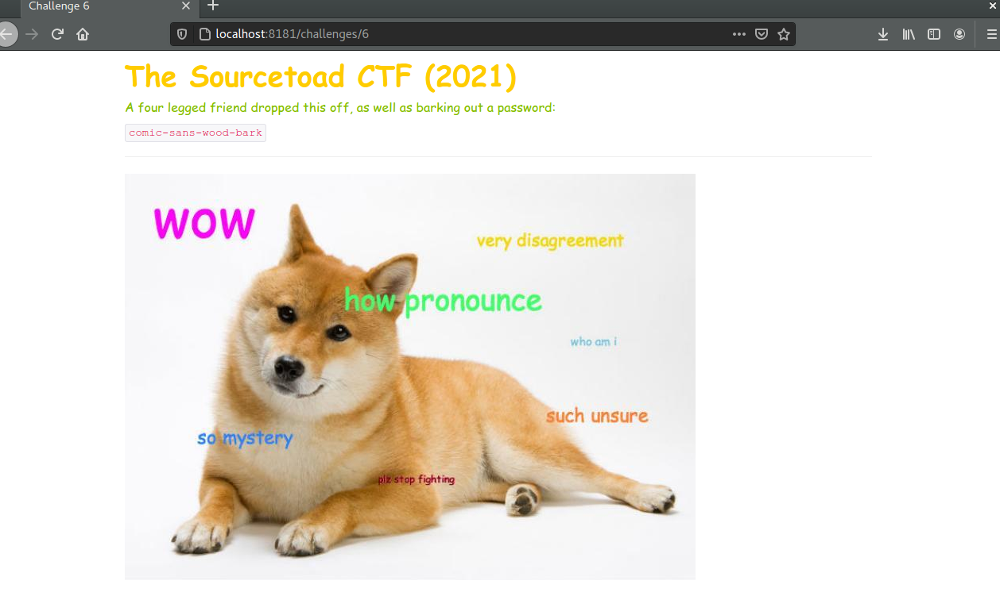
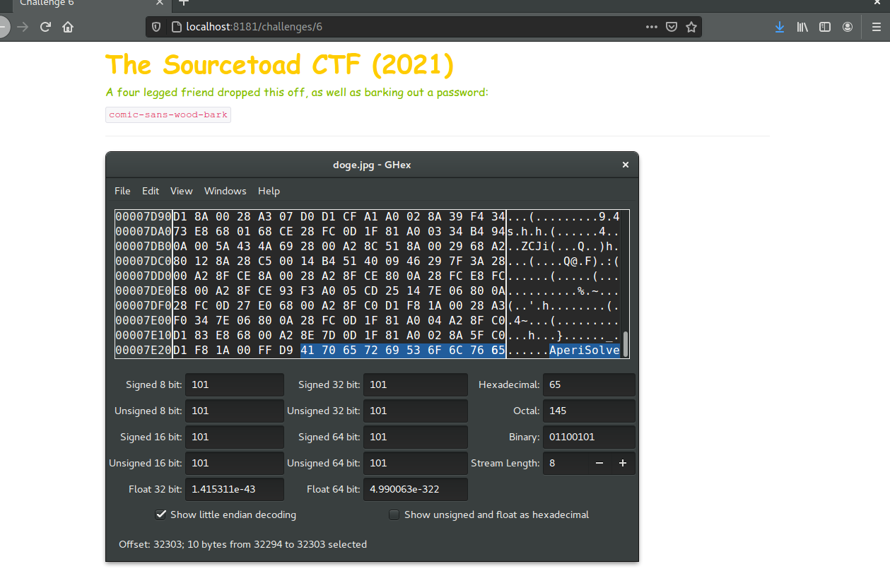
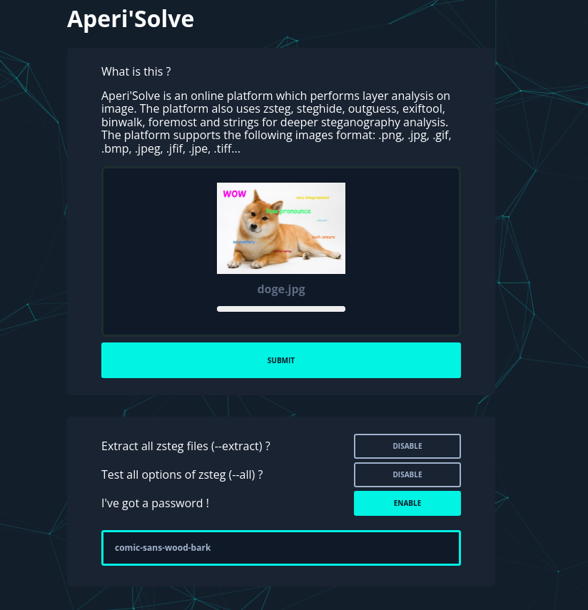

# Challenge 6 (Cicada) Solve

* Category - Steganography
* Difficulty - Medium



---

* This challenge was stepping up the challenge in finding text from an image.
* We were given a JPG and a password this time, which could be so many things.
* Exiftool couldn't find anything interesting, so it was time to peek with a hex editor.

---

---

* Alternatively, we could find this "AperiSolve" word via the [strings](https://linux.die.net/man/1/strings) page

---


 * This site looks pretty easy to use. Upload an image and input the password we saw on the challenge page
 * After this page completes, there is a new section called [outguess](https://www.freebsd.org/cgi/man.cgi?query=outguess+&apropos=0&sektion=0&manpath=FreeBSD+Ports+5.1-RELEASE&format=html) which appears to have a downloadable text component.
 * So now that we know the tool, we should try it out ourselves

```
➜  outguess -k "comic-sans-wood-bark" -r doge.jpg doge.jpg.out
Reading doge.jpg....
Extracting usable bits:   33285 bits
Steg retrieve: seed: 10, len: 33
➜  cat doge.jpg.out 
TOAD{W3lcomeToTheOutGuessJ0urney}                                                                                                  ➜  Desktop 
```
 * This tool looked easy enough with the man page to figure out how to inject parameters and we got our flag!
---

 * You are left with the flag - `TOAD{W3lcomeToTheOutGuessJ0urney}`.