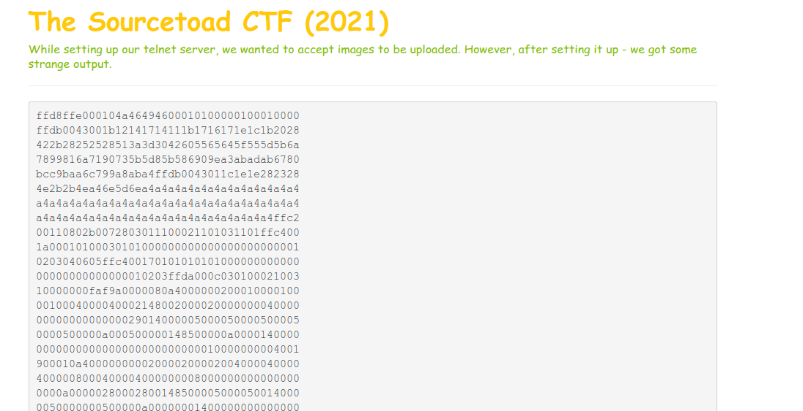
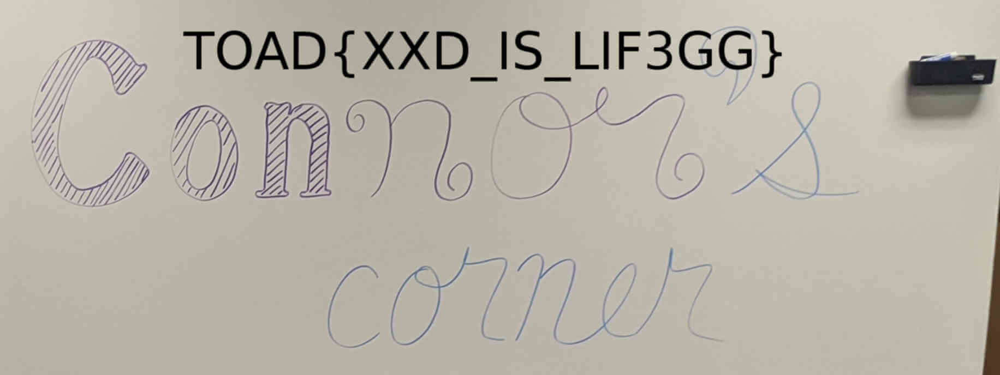

# Challenge 7 (Hexy) Solve

* Category - File/Text
* Difficulty - Medium



---

* This challenge was turning a stream of hexadecimal characters into something useful.
* My usual pattern with anything like this is to pipe the characters back into binary with [xxd](https://linux.die.net/man/1/xxd)
* Since this hexdump has no entries on the sidebar, we know this is a common dump
* So with `cat 7 | xxd -r -p - > 7.bin` to reverse that hex into binary.
* Now right out of the gate, I run [file](https://linux.die.net/man/1/file) over it.
  * This program will attempt to identify the file since I do not know what it is yet.

```
➜ file 7.bin
7.bin: JPEG image data, JFIF standard 1.01, aspect ratio, density 1x1, segment length 16, progressive, precision 8, 1832x688, frames 3
```
---

* So it was a JPG. Now I just renamed it and opened it.

```
➜  mv 7.bin 7.jpg
```



 * You are left with the flag - `TOAD{XXD_IS_LI3GG}`.