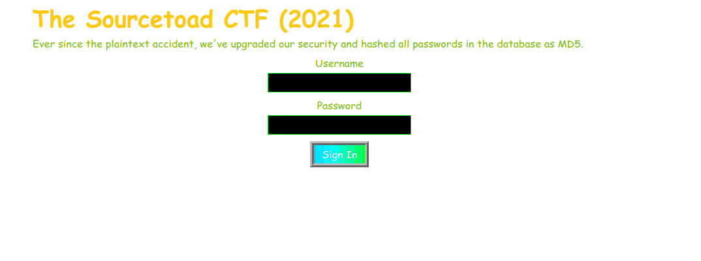
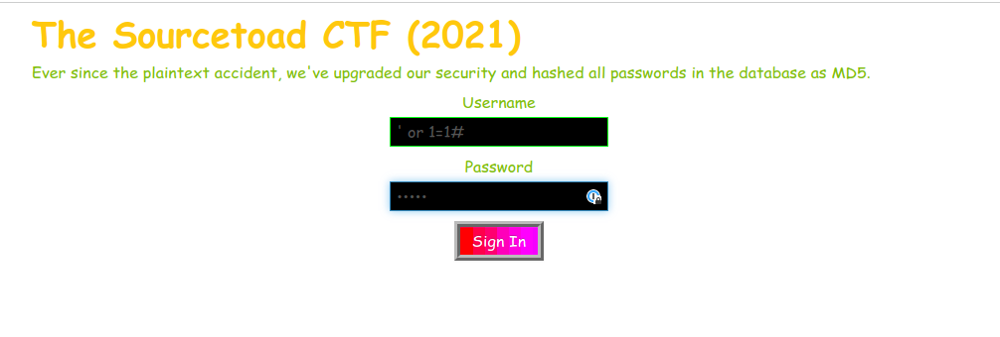
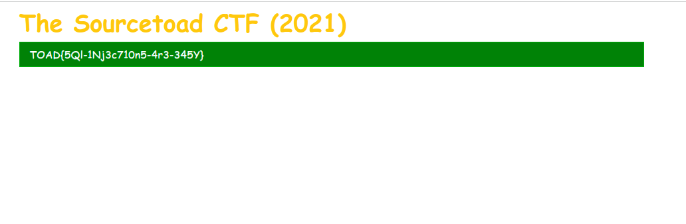

# Challenge 8 (Injectii) Solve

* Category - File/Text
* Difficulty - Medium Hard



---

* This challenge was a SQL Injection at the core.
* Right out of the gate, hint mentions that all passwords are MD5.
  * Any system using password as dated as md5, probably can't use `password_verify`
  * So I'm guessing even if we put malicious content in the password. It would not work.
* So I prefer testing with like `' OR 1=1#`. The single quote will end the expected contents of the value while the OR
additional logic (`1=1`) that is obviously true and then finally `#` comments out the rest of the query.
* Since this repo also has the challenge, we can just peek at the query

```sql
SELECT * FROM `users` WHERE `username`= '$username' AND `password`='md5($password)'
```

* So if we inject our payload into `username`. We will get:

```sql
SELECT * FROM `users` WHERE `username`= '' OR 1=1# AND `password`='md5(random)'
```



---
 * Sure enough that worked and returned the flag. So at least 1 user existed in the DB that we loaded.

---

---
* You are left with the flag - `TOAD{5Ql-1Nj3c710n5-4r3-345Y}`.