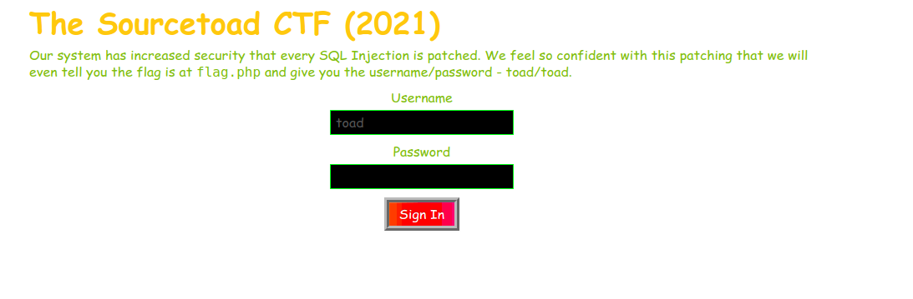
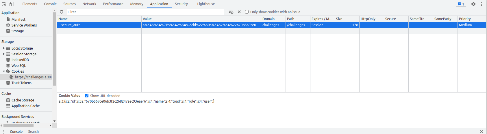

# Challenge 9 (Bluechip) Solve

* Category - Web
* Difficulty - Medium Hard

---

* This challenge was an intro to looking what your cookies hold.
* At first impression, the username & password is given to you.
  * So you can login with `toad` / `toad`.
* It even tells us the flag is at `flag.php`.
* So if we login, then head to `flag.php` we get:

* What is interesting about this message is its telling us we are a `user`, but it expected `admin`.
* Its quite possible this configuration is server side, but we should check how the system knows we are logged in.
* Cookies perhaps?
* The wonder of Google DevTools allows us to see the cookies associated with this website.

* This cookie is unlike a normal PHPSESSION cookie and instead appears to be some serialized contents
* `a:3:{s:2:"id";s:32:"670b569ce06b3f2c268247aec93eaef6";s:4:"name";s:4:"toad";s:4:"role";s:4:"user";}`
  * This looks like a basic serialization with a key/value, but it also includes the length of each key
* If we look at the last section we see `s:4:"role";s:4:"user";`
  * This says a string `s` with a length of `4` is `role`, likewise again with `user`
  * We should try messing with this and changing it to `s:4:"role";s:5:"admin";`
  * This is our cookie, so we can change it however we want.
* So if we change that cookie and reload.

---
* You are left with the flag - `TOAD{5o-YOu-knOW-How-7O-mOdIfy-CooKI3Z}`.